=============================
易度小故事之制作投标书
=============================

.. image:: img/A.0.jpg
  :width: 600
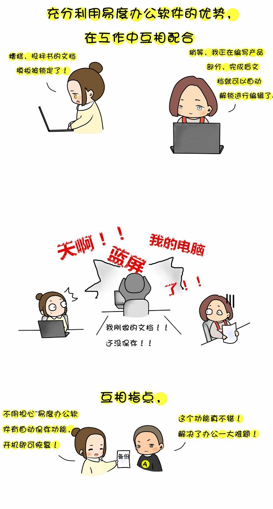
.. image:: img/C.0.jpg
  :width: 600
.. image:: img/D.0.jpg
  :width: 600
   
场景一：投标书的制作
-------------------------------------
.. image:: img/1.0.jpg
  :width: 600

1）根据投标书模板，创建新的投标文档。

.. image:: img/1.01.jpg
  :width: 600

2）创建文档时，选择根据【文档模板】来创建。

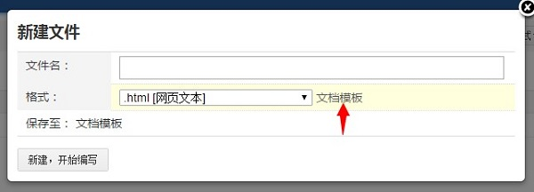

3）找到对应的标书模板

.. image:: img/1.03.jpg
  :width: 600

4）选择模板，点击“确认”，模板设置成功

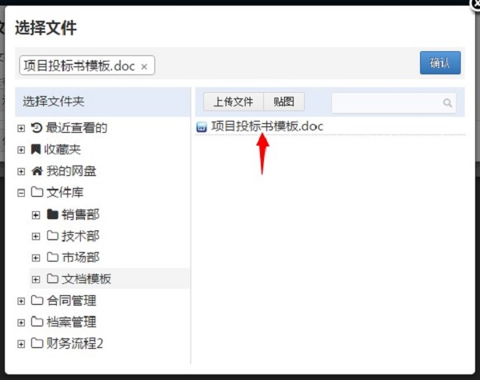

5）调用刚设置好的模板来创建标书文件

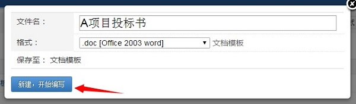
   
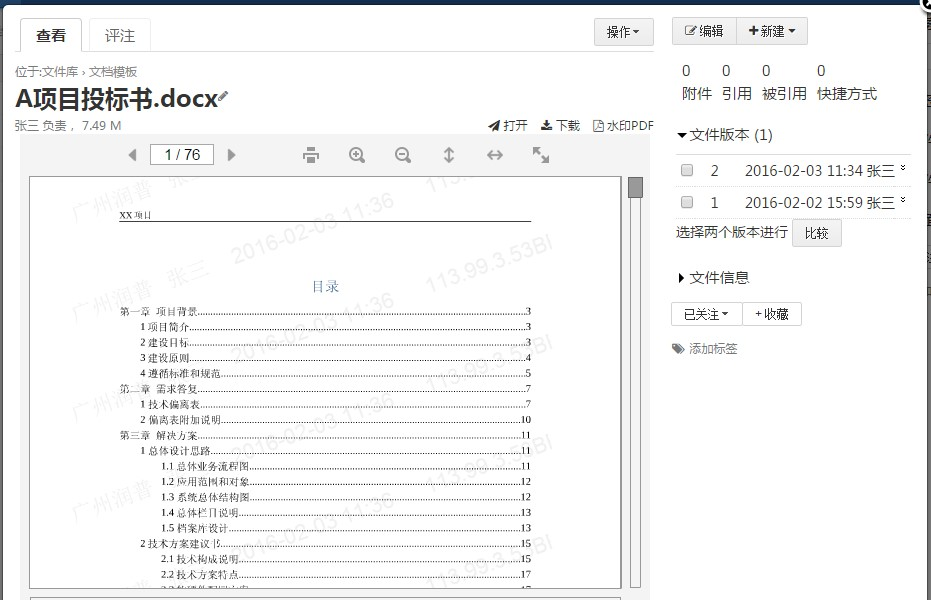
   

.. image:: img/2.0.jpg
  :width: 600   

将编写好的投标书分享给项目组成员，设置好项目组各个成员的权限，授予技术人员和实施人员编辑的权限，其他参与人员可在线进行查看

1）	分享标书；

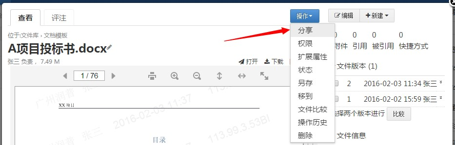
   
2）授予被分享对象具有文档的编辑权限；分享后，项目成员收到相关的消息通知；

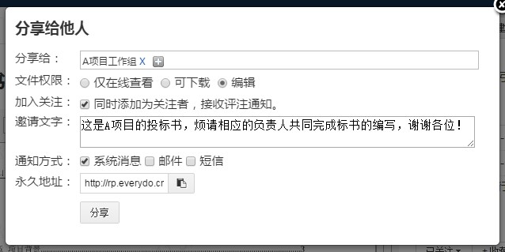
  
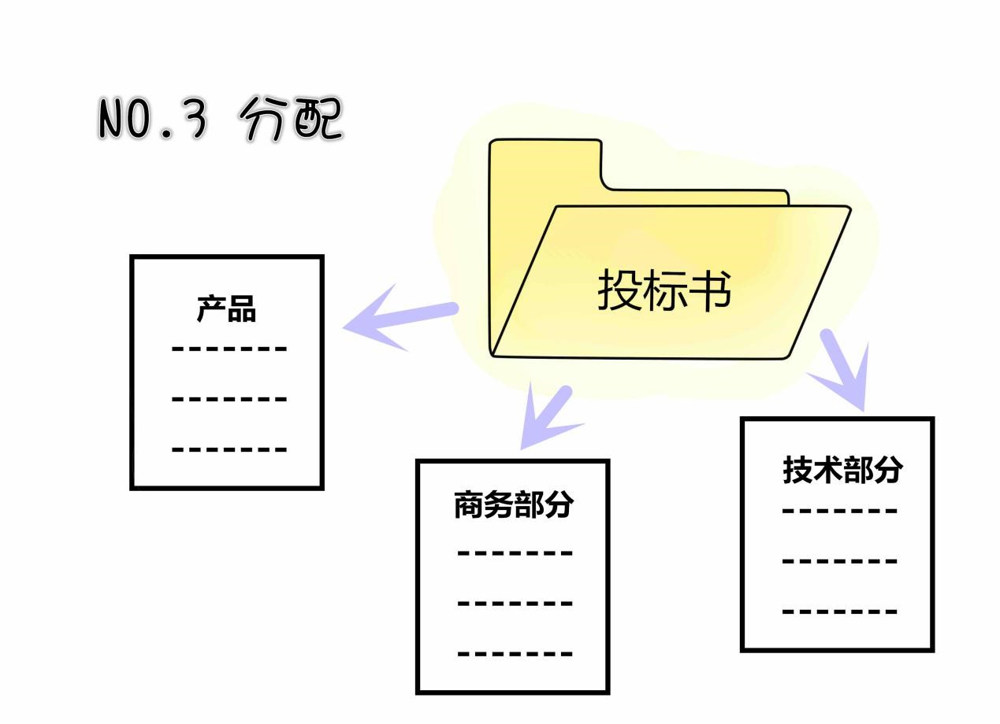
  
  为标书添加描述和评注，分配并通知相关人员完成标书内容的编写。
1）给标书添加描述信息，简述相关内容；

.. image:: img/3.01.jpg
  :width: 600 
  
.. image:: img/3.02.jpg
  :width: 600 
  
2）	添加评注，分配标书各部分内容对应的编写负责人；

.. image:: img/3.03.jpg
  :width: 600
  
.. image:: img/4.0.jpg
  :width: 600 

各成员收到评注通知，查看文档，通过外部编辑，完成标书内容的编写，保存后自动上传到系统当中。
1）	启动【桌面助手】工具；

.. image:: img/4.01.jpg
  :width: 600 
  
2）在系统中点击【编辑】按钮；

.. image:: img/4.02.jpg
  :width: 600   
  
3）桌面助手调用本地office或者WPS软件，对文档进行外部编辑； 

.. image:: img/4.03.jpg
  :width: 600 
  
4）当有人在编辑这份文档时，系统会对文档进行加锁，其他人无法同时进行编辑；

.. image:: img/4.04.jpg
  :width: 600
  
5）文档编写完成，点击保存，系统会自动上传编辑后的最新版本替换原来的文档。

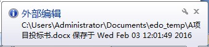
  
.. image:: img/5.0.jpg
  :width: 600

标书修改后，系统会保存一定数量的历史版本，对需要永久保存，方便日后回顾的版本可进行定版，定版后将永久保存该版本。
1）	文档每一次更改后，原来的版本都将作为历史版本保存；

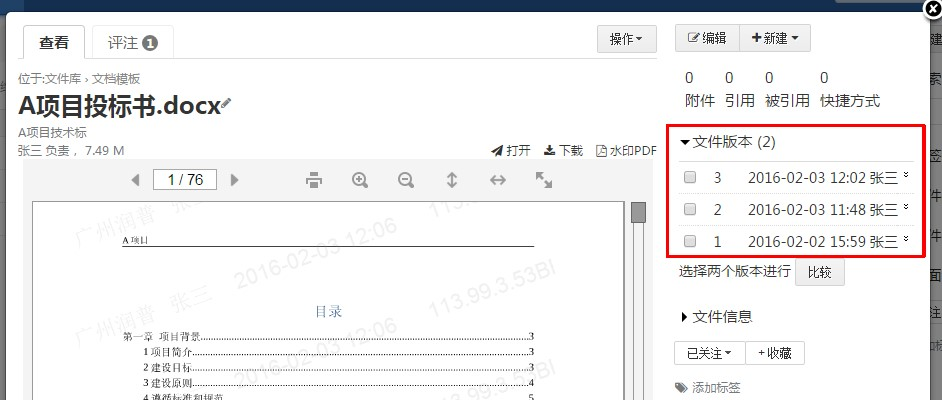
  
2）	系统默认保存的文件版本历史为15个，对于需要永久保存的历史版本，可将其定版，设置版本版次，添加版本描述信息。

.. image:: img/5.02.jpg
  :width: 600
  
.. image:: img/5.03.jpg
  :width: 600  
  
.. image:: img/5.04.jpg
  :width: 600
  
3）如果要查看标书内容的修改情况，可对标书中的任意两个版本进行差异比较；

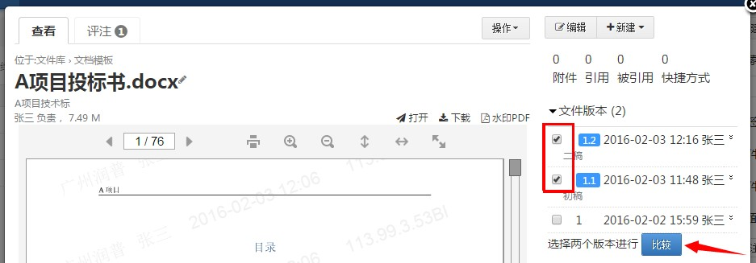
  
4）通过不同颜色突出显示两个版本内容之间的差异；

.. image:: img/5.06.jpg
  :width: 600
  
  
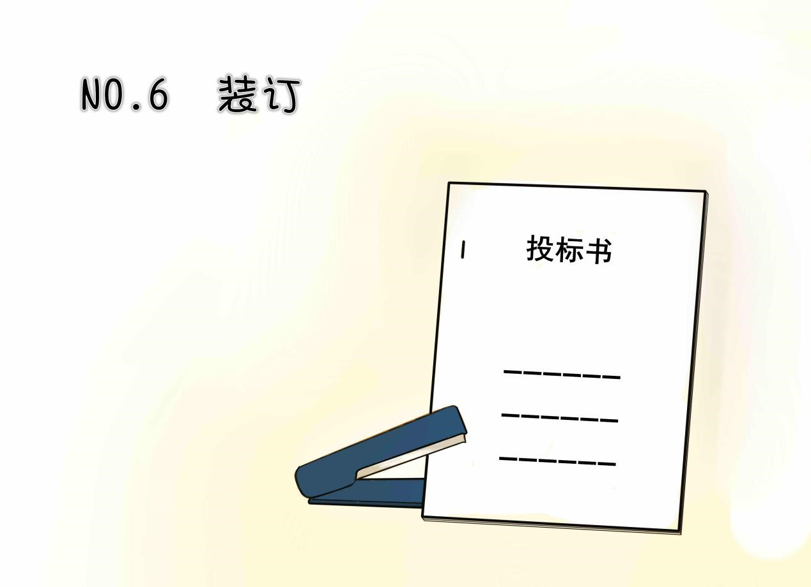
  
完成标书的编写后，可进行在线打印或者下载，开始装订。

.. image:: img/6.01.jpg
  :width: 600
