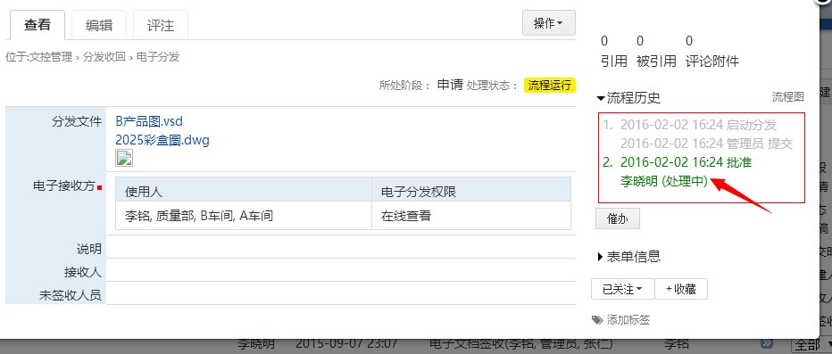
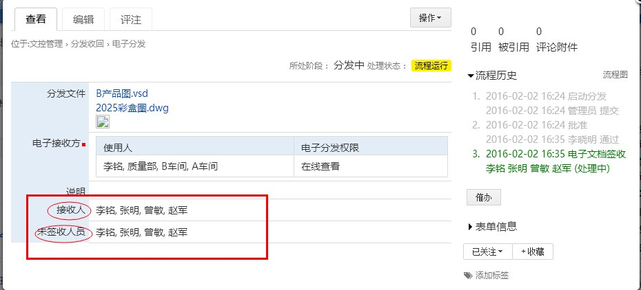
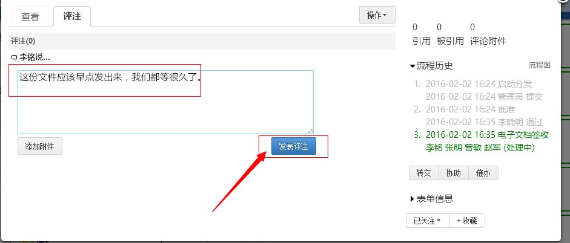
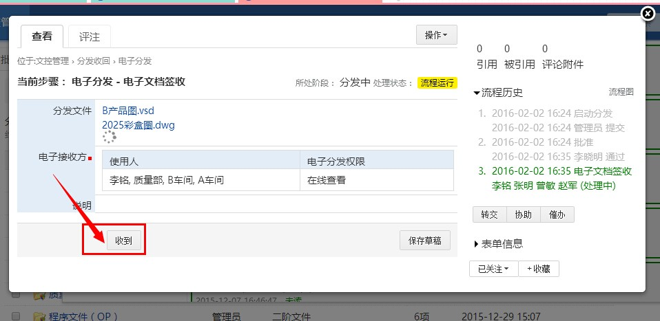
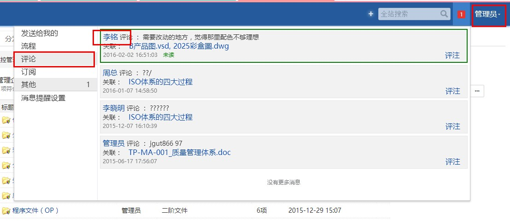
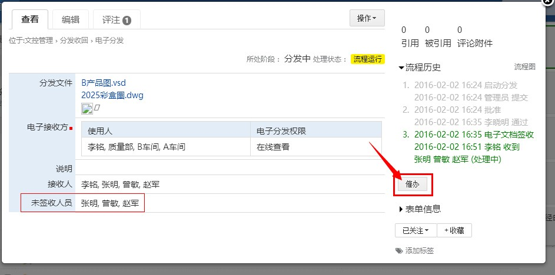

=============================
易度小故事之图纸分发
=============================

.. image:: img/A1.0.jpg
  :width: 600
.. image:: img/B1.0.jpg
  :width: 600   
.. image:: img/C1.0.jpg
  :width: 600
.. image:: img/D1.0.jpg
  :width: 600
   
场景三 ：文件分发
-------------------------------------
.. image:: img/wjsc1.jpg
  :width: 600

1）选择文件所要上传的具体文件夹。

.. image:: img/wjsc2.jpg
  :width: 600

2）点击上传按钮，如上传文件较大的或需整个文件夹上传的情况下，建议使用桌面助手上传的方式上传。

.. image:: img/wjsc3.jpg
  :width: 600

3）通过网页形式上传有两种方式，第一种直接点击“请选择要上传的文件”按钮，第二种将本地电脑上要上传的文件通过拖拽的方式拖至虚线框。不管以上面那种方式最后都不要忘了点击“上传”按钮。

.. image:: img/wjsc4.jpg
  :width: 600
  
  
.. image:: img/wjsc5.jpg
  :width: 600
  

4）现在可以看到刚刚上传的“2025彩盒图”和“B产品图”已经在文件夹样品里面了。

.. image:: img/wjsc6.jpg
  :width: 600
  

.. image:: img/tjlc1.jpg
  :width: 600

通过第一步，要分发的图纸已经上传到了系统中。在提交流程之前，实际上这个分发流程也得已经存在，那第二步我们要将怎么设置分发流程，发放给相关人员。

1）电子分发流程设置，点击“分发收回”，找到“电子分发”点击。

.. image:: img/tjlc12.jpg
  :width: 600

2)出现如下界面。

.. image:: img/tjlc13.jpg
  :width: 600

3）根据公司内部组织架构以及办公流程，进行分发步骤以及审核人的设置。

.. image:: img/tjlc14.jpg
  :width: 600

4）接下来，由设计部员工将刚刚上传上来的两个文件——“2025彩盒图”和“B产品图”提交分发流程，这个过程可以有两个方式：第一种方式在“文件库”界面，勾选相关文件，点击“关联表单”按钮，找到“电子分发”。

.. image:: img/tjlc15.jpg
  :width: 600
  
.. image:: img/tjlc16.jpg
  :width: 600  
  
  
第二种方式，在“分发收回”流程管理界面，点击“创建”按钮。

.. image:: img/tjlc17.jpg
  :width: 600  

显示如下界面：

.. image:: img/tjlc18.jpg
  :width: 600  
  
选择需要分发的文件：

.. image:: img/tjlc19.jpg
  :width: 600  

选择要分发到的人员或者部门，设置好电子分发下去给到的权限。点击“提交”。

.. image:: img/tjlc110.jpg
  :width: 600  
  
.. image:: img/ffsp1.jpg
  :width: 600    
  
  
1）文件一旦被提交了，就会自动关联流程，相关步骤审核人会在流程走到他那里的时通过系统消息或者短信、邮件等方式接收到待处理流程的提醒。如下图，分发流程走到了“批准”我们看下“李晓明”登录系统的提醒消息。
  
  

  
  
2）登录“李晓明”，界面显示消息通知。

.. image:: img/ffsp3.jpg
  :width: 600 
  
3）查看消息内容。

.. image:: img/ffsp4.jpg
  :width: 600

  
.. image:: img/ffsp5.jpg
  :width: 600

4）同样，分发流程的提交人“管理员”这个账号的用户登录进系统，也能在右上角接收到系统消息的提醒，提示我提交的流程当前状态是已经通过或者打回，以及是在什么时候被通过或者打回的。

.. image:: img/ffsp6.jpg
  :width: 600
  

.. image:: img/fffk1.jpg
  :width: 600

1）在“分发审批”中已经通过了分发流程的文件自动会分发给事先设定好的即：A车间、B车间、质量部、李铭等相关接收人。  

2）相关接收人“李铭”凭自己账号和密码登录系统，通过系统消息提醒，得知，有一个文件是分发给他待他签收的，李铭进入表单，查看文件内容，可添加自己查看文件后对文件内容的意见或建议，如没有意见或建议也可直接点击“收到”按钮。

.. image:: img/fffk3.jpg
  :width: 600

  
.. image:: img/ffjl1.jpg
  :width: 600  
  
1）文件分发人员凭账号和密码登录系统，查收到接收方“李铭”对文件所做的消息评注。  
  

  
2）能够知道，到目前这个时间段未知还有那些人员，没有进行文档的“签收”。  
  
.. image:: img/ffjl3.jpg
  :width: 600    
  
.. image:: img/wscb1.jpg
  :width: 600  
  
 1）对未签收人员发起催办，可以选择消息通知方式。  
  

 
 
.. image:: img/wscb3.jpg
  :width: 600   
  
  
  
  
