=============================
易度小故事之合同审批
=============================

.. image:: img/A2.jpg
  :width: 600
.. image:: img/B2.jpg
  :width: 600   
.. image:: img/C2.jpg
  :width: 600
.. image:: img/D2.jpg
  :width: 600
   
场景四：项目资料查阅
-------------------------------------
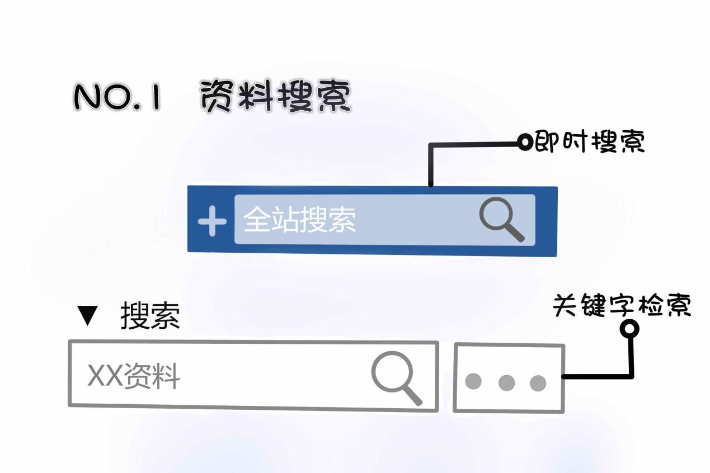

主动搜索有三种方式：关键字检索、高级搜索、标签组筛选。

1）关键字检索
其中关键字搜索根据搜索的范围不同也是有两种方式的，先来说下第一种，对整个站点关键字检索。

在下图标号①中输入“银行”二字，搜索的范围是整个站点的内容，我们可以看到下图标号；②是在我们输入“银行”二字时系统会自动弹出整个站点里与这两个关键字最契合的内容，也就是我们说的“即时搜索”。

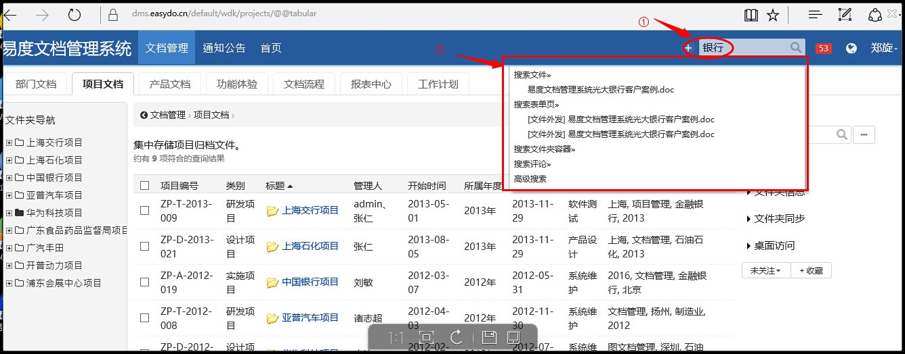

在上面弹出的“即时搜索”没有想要的内容时，可以按“回车”键，系统会将整个站点带有“银行”这两个关键字的内容全部显示出来，包括压缩包。

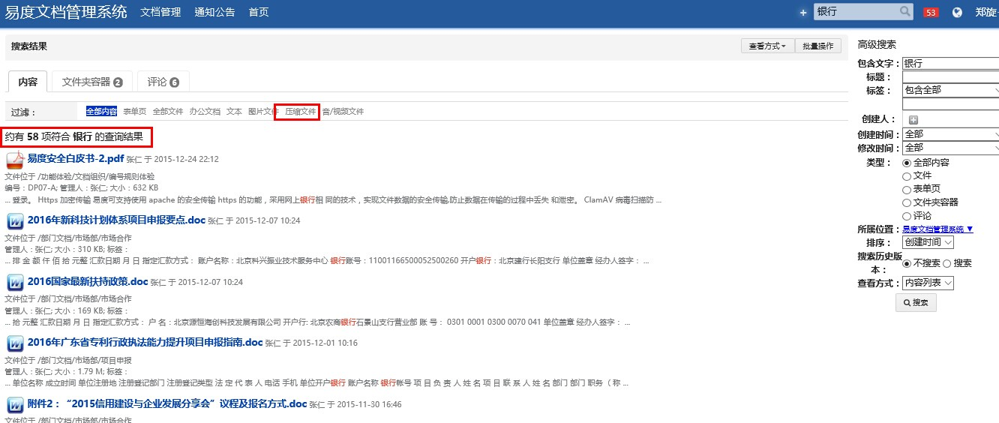

接下来第二种是对文件夹里面的关键字检索。
来到相关的文档库界面，如下图，郑旋来到了“项目文档”界面，在右边搜索框里面输入“银行”二字，这个时候搜索的范围就只是“项目文档”里面的内容了。

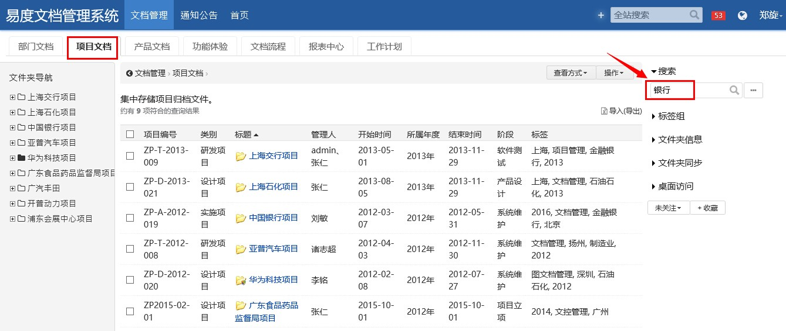

.. image:: img/zlss5.jpg
  :width: 600

2）高级搜索
在1中我们通过关键字搜索出来的结果还是会比较多，而这些结果要一个一个去筛选手工来做是比较困难的，所以我们还可以利用高级搜索工具来细化搜索。

①对整个站点的高级搜索是将鼠标放在“全站搜索”框，则“高级搜索”自动弹出；

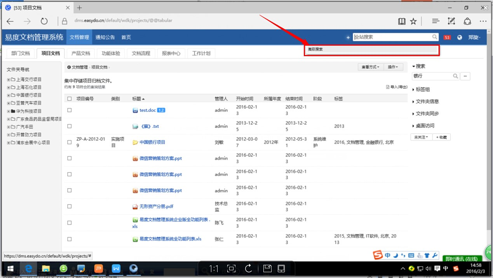

②对文件夹的高级搜索，进入到相关文档库界面，如李璇进入“项目文档”库，如下图点击右边“。。。”按钮；

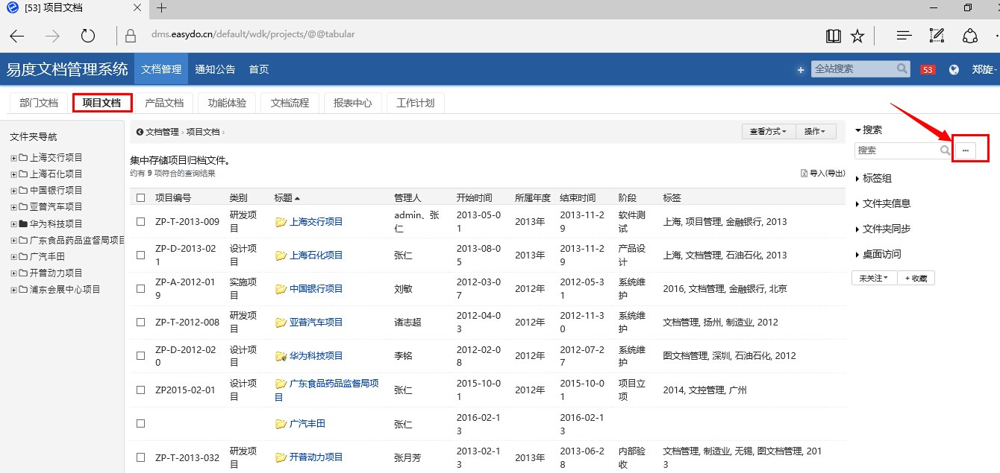

③高级搜索可以根据文件的标签、标题、创建人、创建时间、格式等等来进行细化检索。

.. image:: img/zlss8.jpg
  :width: 600

   
3）标签组筛选

这个功能有淘宝经验的用户一定不陌生，就像我们要买一款手机，可以根据喜欢的颜色、价位、品牌等这些标签进行筛选从而找到最适合我们的产品。李璇现在要找的文件是项目文件，而且是银行类的资料，所以他就可以直接通过标签组进行筛选。

.. image:: img/zlss9.jpg
  :width: 600

   
根据第一步搜索到的结果，点击自己要看的相关文档。易度云办公平台支持100多种格式的在线预览，相当于是一个“百度文库”+“优酷视频”的结合体，而且压缩包无需解压。

1、office文件

.. image:: img/cyzl2.jpg
  :width: 600   

.. image:: img/cyzl3.jpg
  :width: 600  
  
.. image:: img/cyzl4.jpg
  :width: 600 
  

   
2、视频音频（无需安装插件即可在线播放）

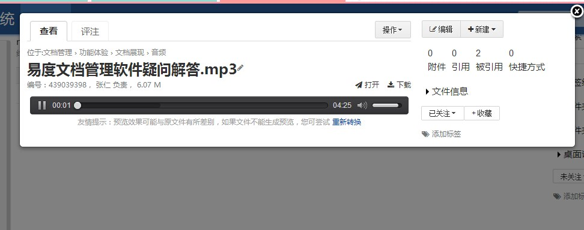
   

   
3、压缩包

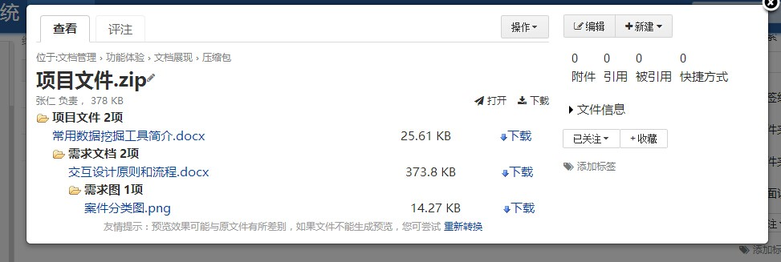
  
4、图片  

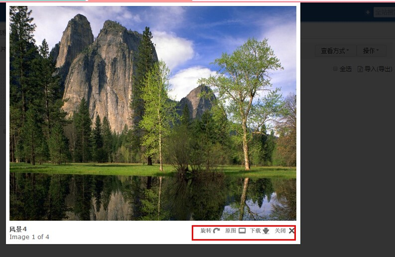
   

李璇在点击“设备管理”这个文档时发现“提示：没有权限...”这时候就需要发起文档借阅流程。

.. image:: img/tjlc2.jpg
  :width: 600 
  
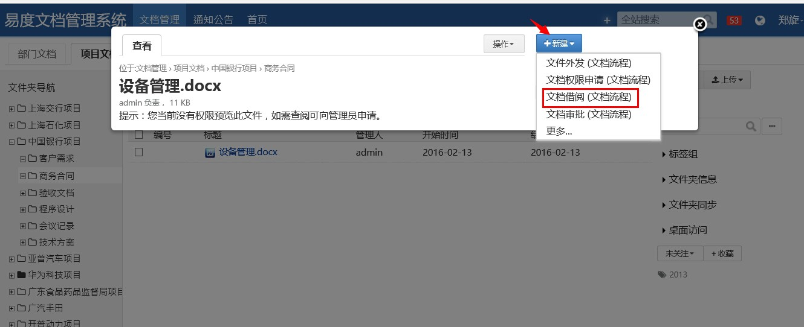
  
  
选择好借阅期限，申请需要查看的权限，勾选是否需要借阅实体档案，然后点击“提交”按钮；
  

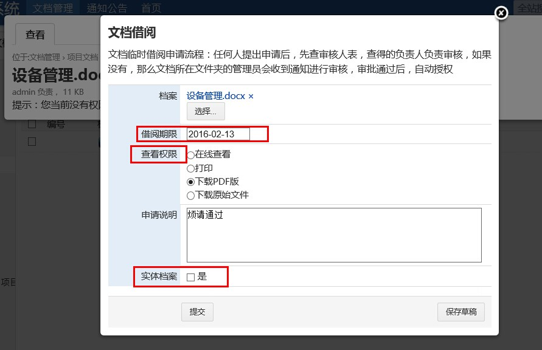

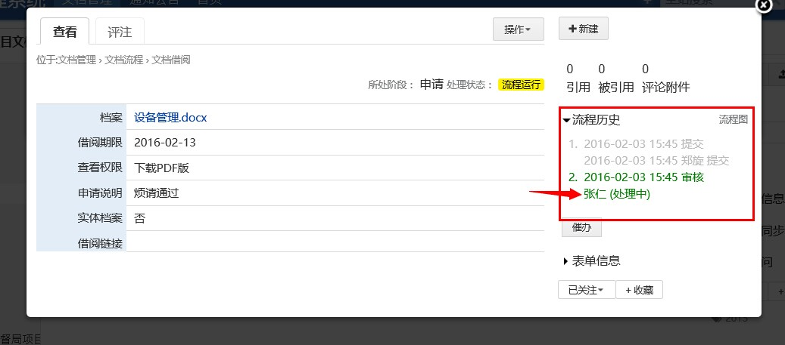

.. image:: img/jysp1.jpg
  :width: 600 

1、郑旋在自己的账号里可以看到自己所提交的流程，现在已经走到了负责人“张仁”那里；

.. image:: img/jysp2.jpg
  :width: 600 

2、张仁在很长一段时间都没有登录系统，郑旋可以选择“催办”，以及消息提醒方式；

.. image:: img/jysp3.jpg
  :width: 600 

.. image:: img/jysp4.jpg
  :width: 600 

3、张仁收到流程提醒信息，登录系统并处理相关流程。

.. image:: img/jysp5.jpg
  :width: 600 

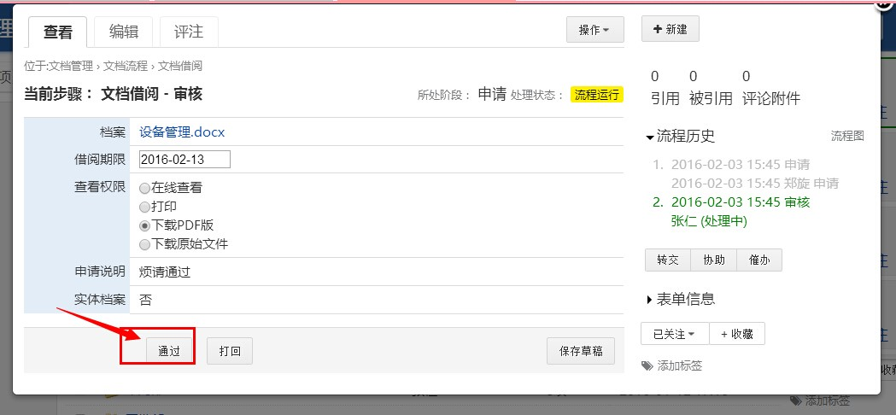

