=============================
易度小故事之文档管理规划
=============================

.. image:: img/wdglgh/A2.jpg
  :width: 600
.. image:: img/wdglgh/B2.jpg
  :width: 600   
.. image:: img/wdglgh/C2.jpg
  :width: 600
   
场景五：文档管理规划
-------------------------------------
.. image:: img/dyjg1.jpg
  :width: 600

通过文档管理系统构建销售部文档库。对文档进行有效的分类管理。

.. image:: img/dyjg2.jpg
  :width: 600

创建个人网盘的文件分类；

.. image:: img/dyjg3.jpg
  :width: 600

.. image:: img/dyjg4.jpg
  :width: 600
  
  
共享文件夹给其它人员；

.. image:: img/dyjg5.jpg
  :width: 600

.. image:: img/dyjg6.jpg
  :width: 600

.. image:: img/px1.jpg
  :width: 600

文件夹目录排序,可以按照标题,大小,修改时间来进行排序；

.. image:: img/px2.jpg
  :width: 600

文件排序，可以按照标题，大小，修改时间来进行排序；

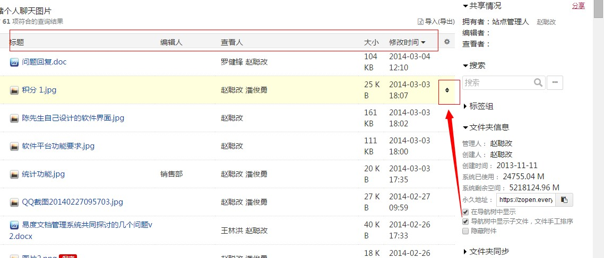

.. image:: img/dyjb1.jpg
  :width: 600

通过设置受控文件夹，可保证一般查看人无权查看到未发布的内容，保证文档发布的过程正确性。

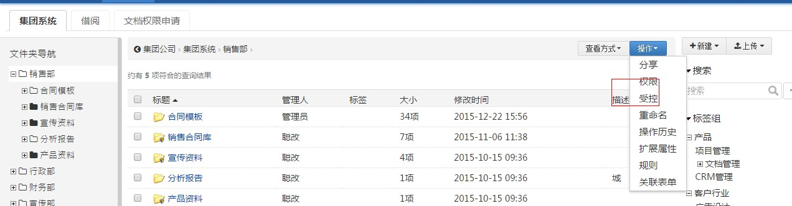

.. image:: img/dyjb3.jpg
  :width: 600

支持文档审核的一般流程：提交审核—>审核通过—>正式发布，中间可安排众多的审核过程，采用消息通知流程变更。一旦发布，禁止对文档的修改，实现文档保护。对于发布的文档，可以调整文档的有效期限，包括生效时间和失效时间，还支持文档自动编号和调整文档编号。
在这个过程中文件状态分为草稿,待审状态即流程运行,发布和废弃状态几种。

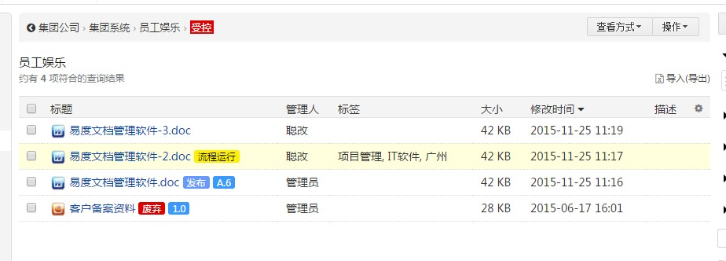
  
.. image:: img/dytx1.jpg
  :width: 600  
  
标签能从多个角度、多个层次进行全面的标签分类浏览，通过标签组快速查找到相关的文档，一个文档可添加多个标签。
自定义标签组内容:
  
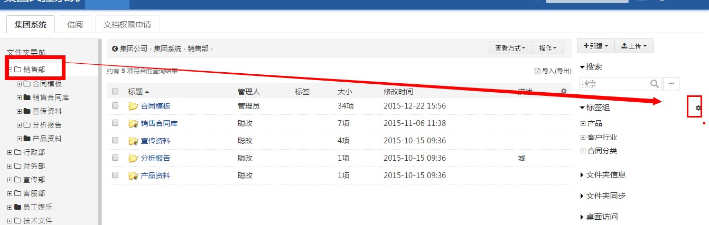
  
.. image:: img/dytx3.jpg
  :width: 600     
  
给文档添加标签:   
  
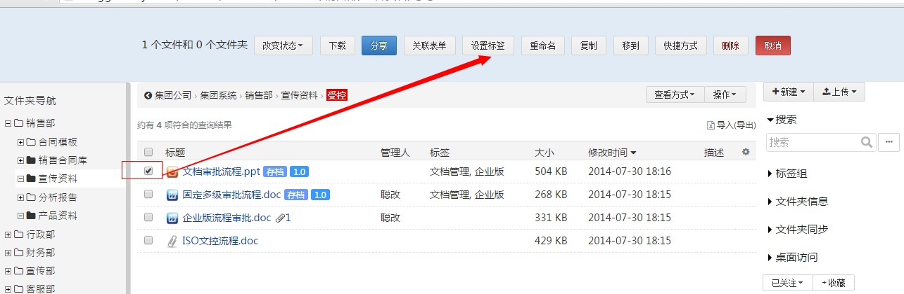
  
.. image:: img/dytx5.jpg
  :width: 600   
  
如何使用标签：  
  
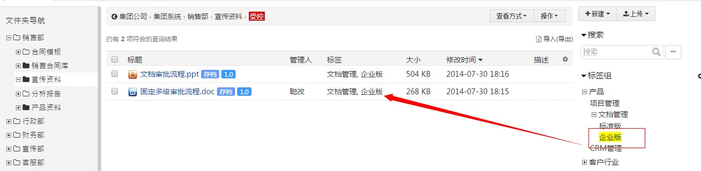

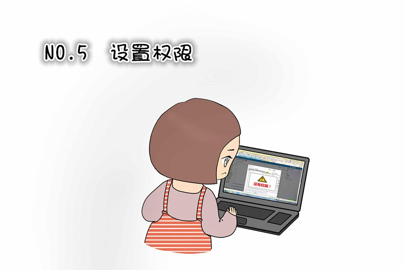

任何一份文档都会有一定的使用范围和不同用户的使用权限。

分别控制用户的文件查看、下载、上传、修改、复制、移动、删除、发布等权限，从而保证文档在使用过程中的安全。

管理人:销售经理及经理委托人
上传人:销售部
查看人:全部销售部人员,具体等级根据文件情况授权
审核人:销售经理及经理委托人
编辑人: 销售部经理,合同管理人,产品经理

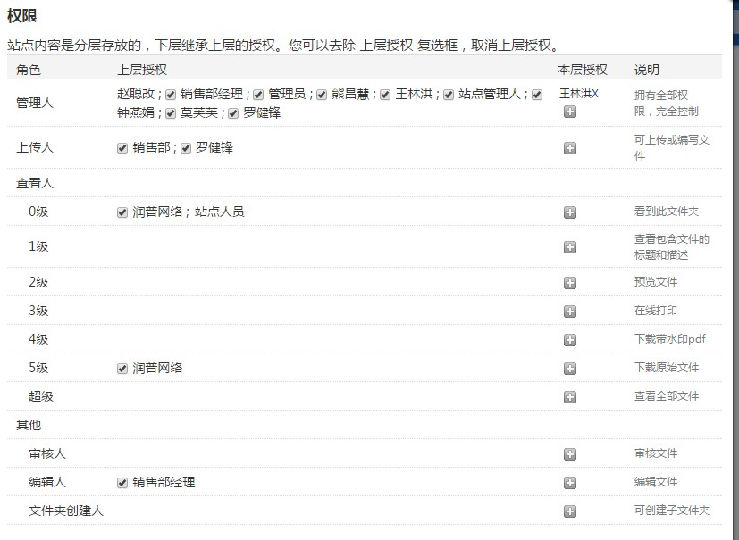

销售部管理人授权

管理人:销售部经理或销售部经理委托人授权

.. image:: img/szqx3.jpg
  :width: 600

权限继承：
系统提供权限继承机制，保证用户在拥有父文件夹管理权限的同时，也将拥有所有子文件夹的管理权限。

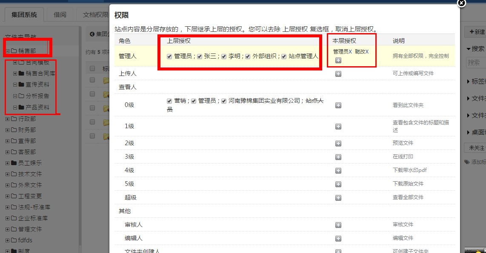

销售部内成员一般授权：
系统支持四层7级别查看人角色权限，通过不同的角色权限，可以控制文档预览、添加、编辑、下载等权限。 

.. image:: img/szqx5.jpg
  :width: 600

.. image:: img/gllc1.jpg
  :width: 600

把销售部内文件所需要走的流程设置好关联关系,可以更快捷方便在新建按钮时进行利用流程。
页面中间点击操作按钮下面的关联表单,如图示：

.. image:: img/gllc2.jpg
  :width: 600
  
  
创建关联关系后点击保存按钮；

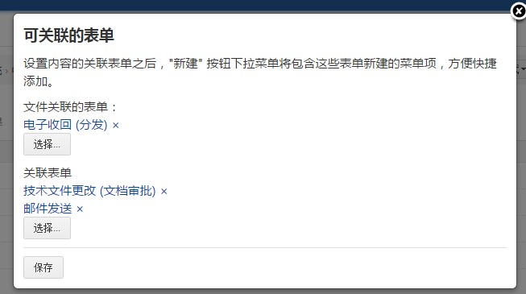

使用关联流程时候点击新建；

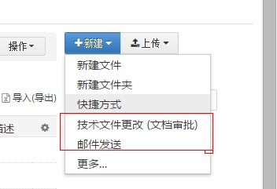

