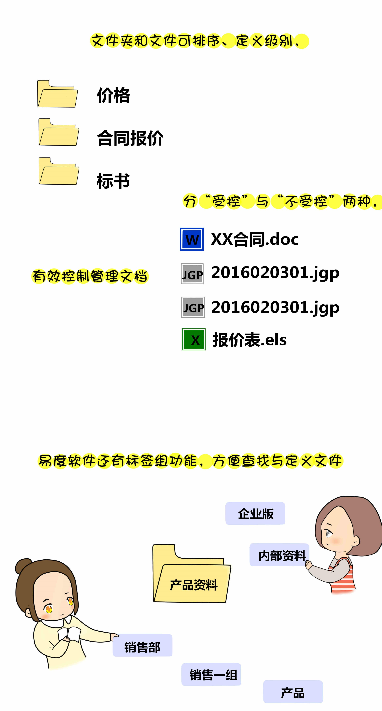
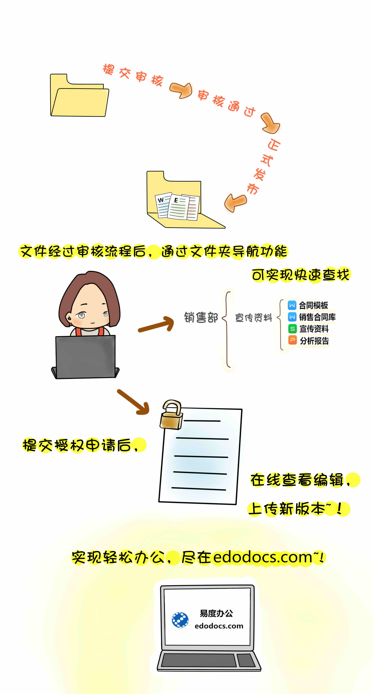

=============================
易度小故事之文档管理规划
=============================

   
场景五：文档管理规划
-------------------------------------

通过文档管理系统构建销售部文档库。对文档进行有效的分类管理。

.. image:: img/dyjg2.jpg
  :width: 600

创建个人网盘的文件分类；

.. image:: img/dyjg3.jpg
  :width: 600

.. image:: img/dyjg4.jpg
  :width: 600
  
  
共享文件夹给其它人员；

.. image:: img/dyjg5.jpg
  :width: 600

2）高级搜索
在1中我们通过关键字搜索出来的结果还是会比较多，而这些结果要一个一个去筛选手工来做是比较困难的，所以我们还可以利用高级搜索工具来细化搜索。

①对整个站点的高级搜索是将鼠标放在“全站搜索”框，则“高级搜索”自动弹出；

.. image:: img/zlss6.jpg
  :width: 600

