=============================
易度小故事之文档同步
=============================

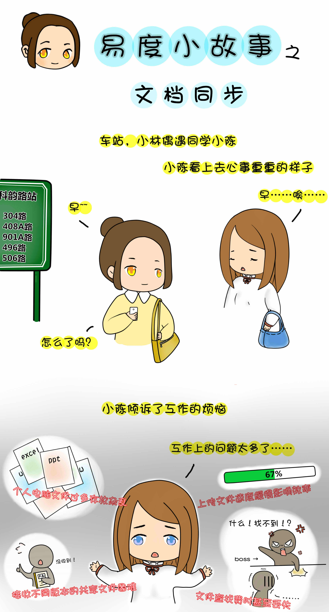
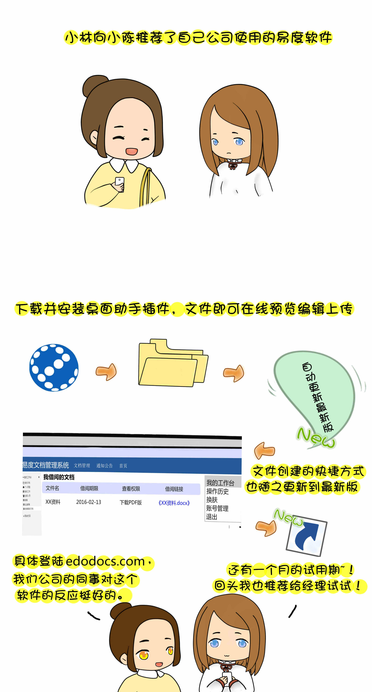

   
场景六：文档同步
-------------------------------------
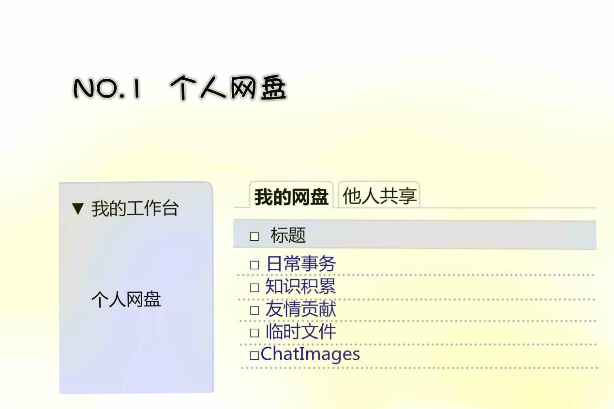

登录个人帐户后,找到我的工作台,点击个人网盘；

.. image:: img/grwp1.jpg
  :width: 600

.. image:: img/xzcj1.jpg
  :width: 600

页面右侧找到的“文件夹同步” ；

.. image:: img/xzcj2.jpg
  :width: 600

根据具体使用客户端情况下载所需要的桌面助手程序工具,如windows版；

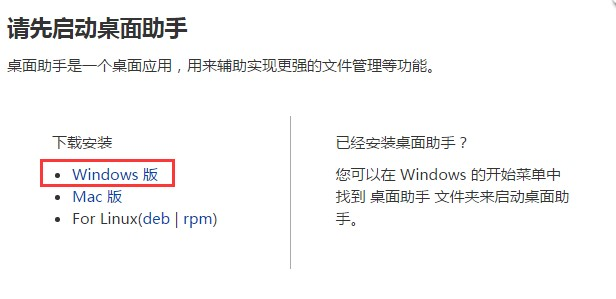
  
.. image:: img/azcj1.jpg
  :width: 600  
  
下载后程序点击安装运行,安装简单直接点击下一步下一步即可安装成功；

.. image:: img/azcj2.jpg
  :width: 600

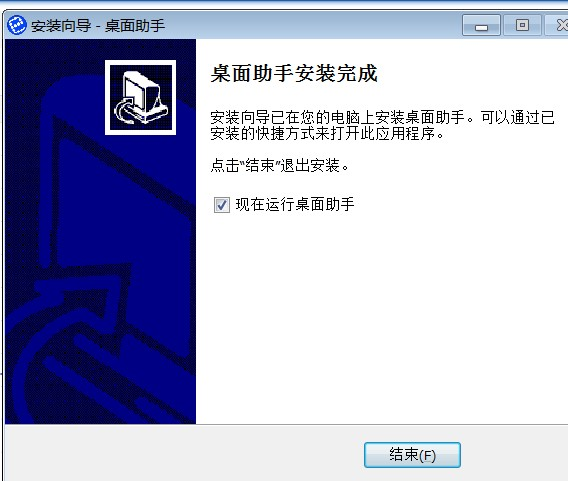

安装成功后桌面出来如下图：

.. image:: img/azcj5.jpg
  :width: 600

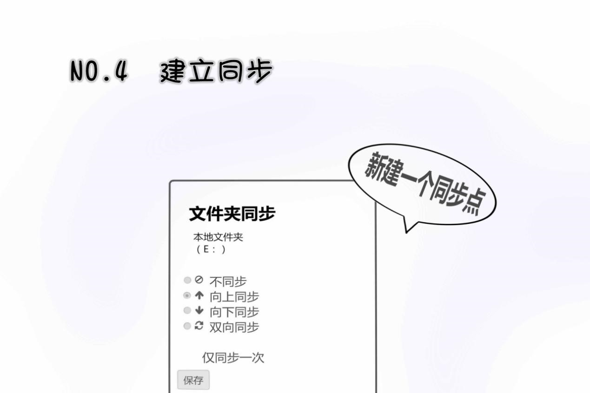

把桌面CG文件夹同步到个人网盘,点击新建一个同步点按钮,选择本地电脑文件夹,根据需求设置向上同步或其它，保存即可。
说明:下图不同步按照表示,不开启同步功能：向上同步:把客户端文件同步到系统设定好的目录下；向下同步:把设置好的目录下文件同步到客户端对应目录下；双向同步:表示客户端更新文件向系统目录同步的同时,系统文件同时向客户端文件进行更新。

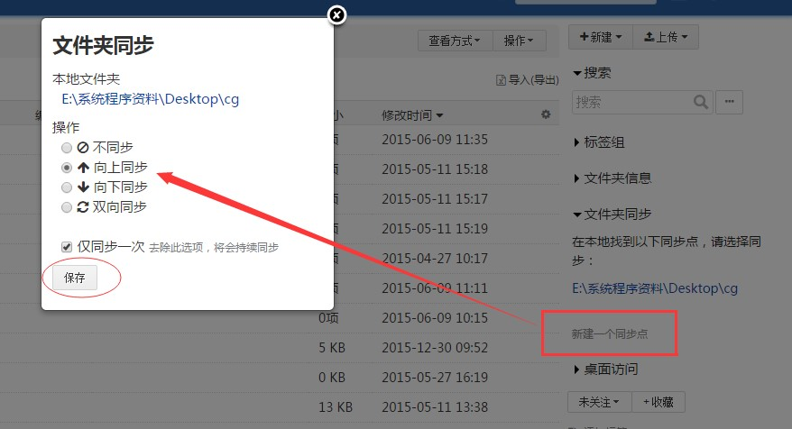

当成功后桌面助手会有提示出来：

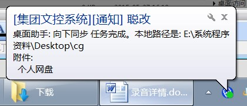
  
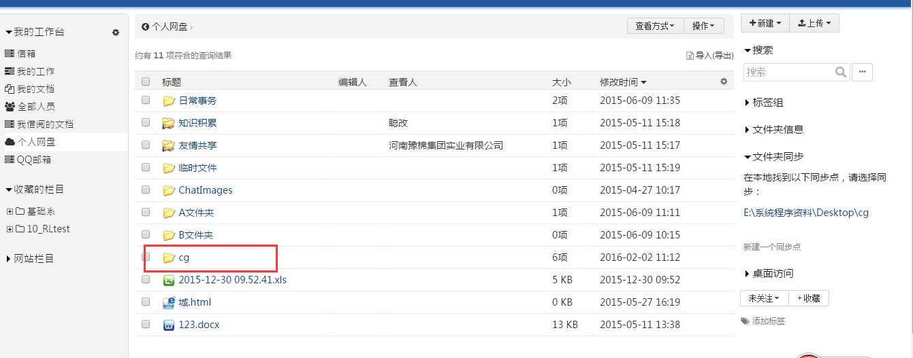
  
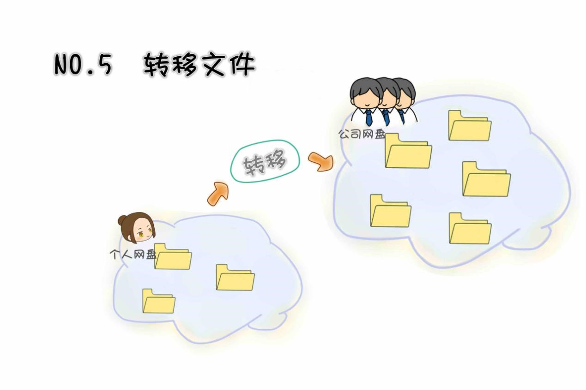

把同步到个人网盘后的文件夹或文件移动到公司公共文件区销售部内对应目录下面；

.. image:: img/zywj2.jpg
  :width: 600

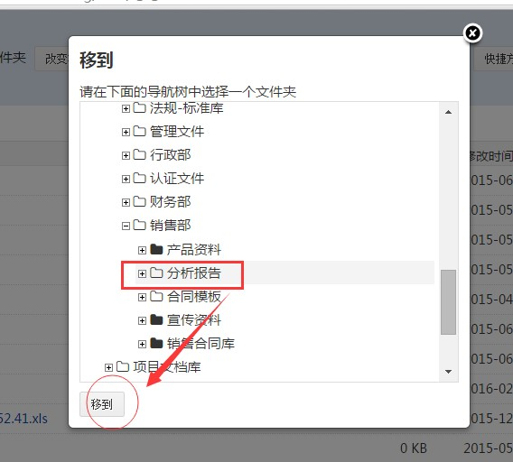

通过创建快捷方式创建部门文件；

.. image:: img/zywj4.jpg
  :width: 600
  
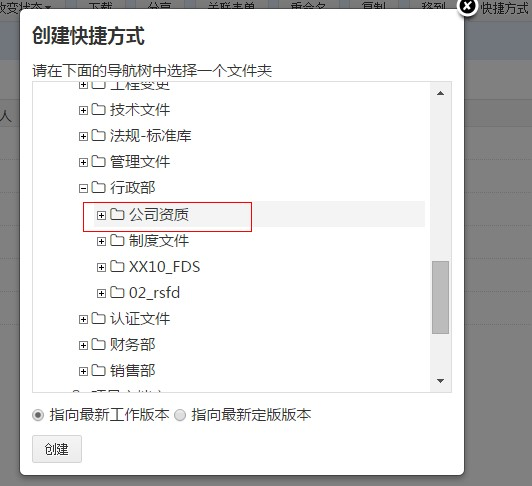
  
以快捷方式创建成功的文件标识与普通文件有明显区别,见图。打开正文会显示原文件来源:原文件的更新后,以快捷方式创建的文件也会随之更为最新版本。
  
.. image:: img/zywj6.jpg
  :width: 600   
  
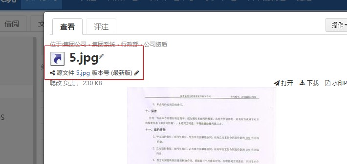
  
