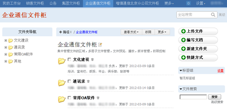
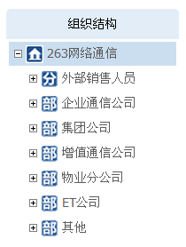

=========================================================
从数据管理升华成知识管理 - 263建立企业知识库
=========================================================

`易度文档管理系统 <http://www.edodocs.com/>`_ 为263构建企业知识库，把数据文档安全可靠地集中管理起来，便于检索和应用。使用系统中提供的文档协作和应用功能，可把文档管理从单纯的数据管理升级至知识管理层面。

**263简介**

263网络通信是中国最早最具实力的互联网接入服务提供商之一、中国最大的专业电子邮件运营商、首批拥有多方通信许可牌照的10家企业之一、国内首批拥有IP-VPN许可牌照的5家企业之一。

263网络通信拥有自有的电信级全国性IDC，采用业界顶级的邮件硬件设备，积累了电信级的运营经验，建立了完善的运维体系，保障企业邮 箱稳定、快捷、安全的高质量服务。

**公司的现状及存在问题**

作为国内具有代表性的网络公司，263每天所产生的数据、信息、文件都是非常庞大的。哪些数据是一些临时性的，过时的？哪些文件是非常重要的，需要跟其他员工分享学习的？哪些信息是需要保密的，防泄漏的？随着公司的发展，企业文档管理及知识管理方面的问题也暴露了出来。

- 众多的项目合作，业务不断扩展，日益增多的数据资料难以管理；
- 堆积了过多的文档资料，不利于日常的检索和使用；
- 公司在北京、上海、广州、杭州、成都等地建有分公司或办事处，地域等因素阻碍了公司、部门间的交流协作，影响工作效率；

**建立企业知识管理库**

针对这类型的问题，广州润普提出，结合易度文档管理系统，构建企业知识管理库

- 最为基础及重要的一步，建立一个中心文档知识库，集中管理所有文档文件；
- 理清公司文档体系及脉络，实现文档知识的沉淀；

- 采用精细的权限控制体系，保证文档的正常、安全使用；
- 提供毫秒级的全文搜索，可以多维度组合搜索，省时、高效；
- 采用在线预览、版本管理、消息通知等功能优化公司内部间的沟通协作。

**系统安装实施效果**

- 企业知识库安装后，在公司内部得到了广泛的应用，公司组织架构得到更清晰的体现。

- 文档搜索查找速度得到最大限度的提升，使用更方便；

- 以文档为中心，构建一个更直接、更高效的协作环境，提高工作效率。

