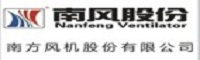

=======================================
制造业
=======================================

.. sidebar:: 相关资源

   - `demo站点 <http://manufacture.oc.easydo.cn/@@loginForm.html?camefrom=%2Flogin%3Fservice%3Dhttp%253A%252F%252Fmanufacture.easydo.cn&isdocsdemo=1>`__
   - `下载试用版 <../download.rst>`__
   - `快速了解系统功能 <../tour/>`__

制造型的企业对于质量体系管理的要求极高，而且企业内部对技术开发和产品生产的效率极为看重。传统的沟通、合作、管理的方式或者效率低下、或者容易导致疏忽出错。一套统一、高效、智能化的解决方案能为企业节约许多质量管理、项目开发、与客户或供应商沟通上的成本。易度对于制造型的企业在生产管理、质量体系管理、项目开发、日常办公方面、经销商管理都提供合理高效的解决方案。

质量体系文件控制
===========================
1) 需求来源

   对于制造型企业来说，生产过程的质量体系管控关系到企业在客户中的形象，更关系到产品生产的效率和品质，这些对企业的长远发展都至关重要。企业需要遵循一套严格的体系管理所有相关文档。质量手册、操作规范、作业指导书、质量表单等文件的撰写、审批、发放、回收、废止等过程需要严格管控。

   与此同时，企业生产对效率要求极高，传统的质量文件管控容易遗漏、容易出错，而且效率不高，花费了企业许多宝贵的时间。

2) 涉及人员

   生产部门主管、产线组长、产线工人、品质管理（质量）人员、体系管理人员、文控专员。

3) 解决方案

   使用 `易度ISO文控系统 <../../solutions/isodoc.rst>`__ ，可以提供符合ISO质量体系标准的文控系统,用来管理质量体系相关的所有文件，提供一套完整流程和权限控制方式，方便企业进行自动化质量体系管控，提高效率同时确保质量。

设计、研发过程
===========================

1) 需求来源

   企业的项目进行过程中，设计开发人员相互之间，或者开发人员与客户或供应商方面的对接人员之间，经常需要沟通交流、传输图纸、发布通知消息，报告进度情况，等等。

   传统的邮件方式效率较低，太多邮件也很杂乱，不好管理。电话通知方式不可靠，发生遗漏、疏忽的可能性很大。企业需要一个统一、可靠的平台进行这些交流和协作。

2) 涉及人员

   研发工程师、项目管理人、客户、供应商

3) 解决方案

   `易度项目管理解决方案 <../../solutions/project.rst>`__ 可以提供这样一个协作平台。企业可以为每一个项目设置相应的企业内部人员和外部人员（客户、供应商对接人员）。项目内有共享的文件库，可以统一发布项目消息，报告进度。确保所有项目成员，不管是内部人员，还是客户、供应商人员，都能及时、准确地获取他需要的信息。项目经理也能进行总体管控。

产品文档统一管理
===========================
1) 需求来源

   技术人员需要统一管理每一款产品的图纸或其他技术文档，生产部门需要获取最新版本的图纸用于生产，采购部门需要获取产品图纸和文档用于外发、外协件的生产、采购，售后或支持服务部门人员需要参考产品文档和图纸展开工作。

2) 涉及人员

   研发人员、采购、生产、售后

3) 解决方案

   `易度产品图文档管理 <../../solutions/tech.rst>`__ 提供了一个统一管理产品图纸和其他技术文档的工具。通过分发或设置权限的方式让企业内部人员获取产品最新资料。解决了传统上用邮件或纸质发放的方式造成的不便和失误。

部门内部文档管理、日常办公
===================================
1) 需求来源

   企业各部门会有许多文档需要在部门内部进行共享和管理，可能是内部知识管理、工作规范管理，等等。文件需要进行版本更新。用户需要关注与自己密切相关的部门文档的最新动态。内部人员之间的快捷地沟通交流。

2) 涉及人员

   各部门内部人员

3) 解决方案

   `易度企业文档管理 <../../solutions/edm.rst>`__ , 分部门进行文档集中管理，文档具有版本功能，用户可对文档订阅、评注，用户之间通过系统的消息功能进行沟通交流。

经销商代理商管理
===================================
1) 需求来源

   市场、品牌、渠道部门，需要管理大量代理商，提供更好的服务。首先是最新的产品资料、市场宣传资料，需要即时的发送给经销商、代理商，其次经销商、代理商需要反馈各种产品需求，需要解答相关问题

2) 涉及人员

   品牌、售后、产品

3) 解决方案

   `易度经销商门户 <../../solutions/marketing.rst>`__ , 提供一个代理商经销商的服务门户。公司内部人员可以发放相关产品营销资料给代理商，代理商可以反馈产品的需求和问题。

制造业典型客户案例
=======================================

`开普动力研发中心 - 文档管理平台 <kaipu.rst>`_
-------------------------------------------------
.. image:: img/logo-kpdl.gif
   :class: float-right

无锡开普动力是一家集科研、生产、销售为一体的国际化集团公司，数码发电机组是公司的拳头产品。

系统在开普动力的研发中心全面推行，使用人数达到100人，其中存储的文档数据达5TB，700万份文档。而且文档数量还在不断攀升。通过严格的权限控制，全方位地保护了核心文档的安全。

`杭州天铭电工具 - 文档权限控制系统 <tmax.rst>`_
-------------------------------------------------
.. image:: img/logo-tmax.png
   :class: float-right

杭州天铭机电工具有限公司是2000年由浙江省人民政府批准成立的拥有自营进出口权的中外合资企业，省级高新技术企业。

通过易度文档管理系统，委托授权企业文档库各类文档的管理人。管理人根据实际情况，再行分配各部门岗位、员工的使用权限，严格把关。不能看到文档、只能看到文档标题、只能查看文档不能编辑、可以下载打印......文档管理系统提供四层六级的权限架构，细致控制不同权限。

广东同益电器有限公司-文档管理库 
-------------------------------------------------

成立于1999年的同益电器，是专业从事热泵技术研发和热泵产品制造的高新技术企业，是国内最早从事空气能热泵热水器研发生产的企业之一。同益热泵旗下拥有同益新能源科技有限公司、同益电器南海生产基地、同益全球营销服务中心以及同益热能工程研发中心。

建立企业文档管理库，通过这个系统平台，帮助公司旗下的各个子公司或部门的协调工作，大大提高了文档文件、客户资料等信息的流通和共享速度，推动工作进展。

`亚普汽车部件有限公司 - 在线办公平台 <yapp.rst>`_
------------------------------------------------------------

公司规模大，组织架构层级多，产生大量重要的文档信息，但却不能集中管控。而各部门、各类型的文档管理混乱，没有有效的控制手段。多个部门，甚至是跨国的分公司之间，员工的沟通协作变得困难，重要的体系文件审核流程复杂，且不能得到安全有效的管理及保护。

易度提出，亚普公司应使用文档管理系统，分类归档公司文档。加入ISO文控系统，使公司的体系文件进入流程化、自动化管理。同时，加入借阅、外发等流程管理，建立起在线沟通平台，跨国、跨部门的文档共享协作。

茂名重力公司-企业文档管理系统
------------------------------------

茂名重力石化机械制造有限公司（以下简称重力公司），由成立于1958年的原中国石化集团总公司茂名石化机械厂于2005年12月整体改制成立。重力公司为中国石化工业的发展提供了乙烯裂解炉对流段、聚丙（乙）烯环管反应器、换热器、套管结晶器、中厚壁反应器等大型和优质装备。

广州润普根据茂名重力公司在文档管理方面的需求,针对性的提供文档管理的解决方案,从文档的集中存储,分类管理,在线查看,文档检索以及文档的权限管控上全方位地解决公司遇到的文档管理难题. 特别是在企业标准化文件和规范文件的管理上,通过严格而又灵活的权限设置后,实现了文件的灵活分享和协作.

`常州智能农业装备研究院 <czzny.rst>`_
-------------------------------------------------------------------------------

常州智能农业装备研究院是由多位海外华人科学家共同组建的民营科技单位,专注于
现代农业技术、农业及工程装备的核心技术开发和推广。

“易度办公系统对于规范我院的文档管理、项目管理和日常办公流程非常重要。现在我院正处于发展阶段，急
需信息化的软件系统提升员工的工作效率，让大家都把精力放在现代农业技术和装备的研究上来。” 

深圳市鸿威盛五金制品有限公司-企业文档管理系统
----------------------------------------------------
.. image:: img/logo-hvs.png
   :class: float-right

鸿威盛是一个快速成长的精密制造配套服务供应商，专注行业、随需而动，致力于成为客户信赖的伙伴。

公司文档数量越来越多，通过易度文档管理系统，能够集中管理起来。系统还提供在线编辑功能，直接在线编辑各种办公文档，方便快捷。通过严格的权限控制，全方位地保护了核心文档的安全。

`宁波技冠智能科技签约易度 - 启用文档管理软件 <jiguan.rst>`_
------------------------------------------------------------------------------
.. image:: img/logo-jiguan.png
   :class: float-right

宁波技冠从事工业及电力自动化系统产品和信息化产品的应用开发，高新技术产品的应用集成，以及新能源技术应用、节能技术应用，智能传感器系统应用开发，以及技术产品进出口。特别注重技术信息的安全保密。

通过咨询沟通，并了解到技冠公司的实际需要。易度建议技冠使用文档管理软件，并提出了相应的解决方案：明确权限架构，控制用户对文档的使用；提供一系列的协作功能，如消息通知、评注等；搜索功能：全文检索、组合搜索。

`上海寰创通信科技有限公司 - 企业工作管理系统 <huanchuang.rst>`_
----------------------------------------------------------------
.. image:: img/logo-huanchang.png
   :class: float-right

上海寰创通信科技有限公司是国内WLAN市场领先供货原厂商，提供WLAN完整系列产品。 公司重视研发投入，依靠团队多年无线宽带领域技术积累，已在WLAN领域申请近20项重要专利。在WLAN与3G融合、复杂组网等方面具有突出领先优势。

广州润普为其提供一个工作管理系统平台，有效管理企业的文档资料，提高项目协作能力。目前，系统已在企业内部得到广泛应用，通过权限设置，流程控制等一系列功能提升企业的工作效率。

上海林频仪器仪表有限公司 – 企业文档管理系统
------------------------------------------------

.. image:: img/lpyq.gif
   :class: float-right

上海林频仪器股份有限公司座落于中国上海市科技产业基地闵行经济技术开发区，是一家专业从事环境试验设备研发、生产与销售于一体的高新技术股份制企业。历经市场洗礼和多年的拼搏积淀，林频仪器现已发展成为环境试验设备领域的龙头企业之一。 在全国主要中心城市北京、上海、沈阳、武汉、郑州、太原、深圳、青岛、厦门等设有分公司或办事处，立足上海，辐射全国。 
  
广州润普为上海林频仪器构建企业文档管理系统，集中存储企业内的所有文档资料，方便搜索和管理。 
通过系统提供的权限控制功能，区分领导、经理、一般职员的文档查阅和下载权限。严防文档被下载和传播。 
现在在公司内推广使用，大大提升了文档查找的效率，节约了时间。

三信国际上海公司-企业文档管理系统库
------------------------------------

三信国际电器上海有限公司是中国最大的工业电器专业制造商之一，是一家专业研发、制造、销售世界领先水平的低压电器及元件、输配电设备、建筑电器、自动化电气、仪器仪表、通讯电器、小型断路器、漏电保护开关、接触器、继电器、稳压电源等产品的国际性无区域企业。

他们更注重于对内部知识文件，重要资料的安全保密和对这些文档文件的使用。使用易度企业文档管理系统，能过权限设置等安全应用功能，全面控制、管理企业知识资产。

江苏太阳鸟照明电器-企业文档管理库
------------------------------------

江苏太阳鸟照明电器座落于江苏省扬中市。公司集照明产品的研发与灯具制造，照明工程规划设计施工与安装、以及灯具的国际贸易，电子商务于一体的多元化、专业化的高新企业。

广州润普为太阳鸟照明器材提供了一个企业文档管理库，分类归档，集中管理企业文档文件，确保重要资料的安全性和易用性，对于企业的整个制造流程和管理流程都有很大的帮助。

`科利电器厂 - ISO文控系统 <keli.rst>`_
--------------------------------------------------

科利电器厂是集开发设计、零部件制造、生产组装、产品试验到交货为一体的制造工厂。

广州润普为其建立ISO文件库，集中管理体系文件、培训资料、技术文档等文件。实现电子化管理文件的入库、借阅、统计，控制文件的起草、审核、发布、收回等流程。同时，在系统当中加入电子签章功能，实现版权保护。

高达电子-研发项目文档管理系统
--------------------------------------------
.. image:: img/logo-gddz.gif
   :class: float-right

广东高达电子有限公司是香港独资企业，总公司位于香港，顺德为主要生产基地。主要生产加工和研发国内外知名企业汽车、家用电器、视听、通讯器材、计算机、手机摄像头等配件,主要客户有日本丰田、飞利浦、松下电器、索尼、三洋等世界500强的企业。公司有5个分厂，2000多名员工分布在日本、香港、中国、美国等地。

高达电子主要应用易度的项目管理和文档管理系统，通过信息化的手段管理公司项目遇到的问题。包括：项目进度的监控、员工任务分配、员工工作报告、项目文档的分类与储存、项目知识积累。现系统已经在公司的研发部中广泛使用，取得了良好的应用效果，降低了沟通成本，提升了沟通和协作的效率。

深圳市泰士特科技有限公司 - 文档共享库
----------------------------------------
.. image:: img/logo-testeck.png
   :class: float-right

泰士特科技成立于2003年，致力于中国测温行业的开拓与发展，并逐步拓展到温度相关领域。产品包括了温度传感器、高温特种电缆、变压器温包等。

通过易度文档管理系统，搭建企业的文档共享库，集中存储所有的公司外发的规范文档。实现了文档的协作和文档的规范管理。大大提升了企业在对内和对外的文档协作沟通的效率和质量。

`长春启明菱电车载电子有限公司 - 企业文档管理系统 <qiminglingdian.rst>`_
-------------------------------------------------------------------------------

启明公司现已有员工一千多名，公司的主营软件的开发、系统集成、技术服务、产品研发制造、系统集成及增值服务等广泛的业务。伴随着员工和业务的增加，各类文档资料也越来越多，包括销售合同、技术信息等。同时，亦要防止众多员工中出现泄密的情况。

易度提出从底层解决启明公司的问题，构建文档管理系统，集中存储管理所有的资料文档。

浙江凯迪仕实业有限公司-企业文档管理系统
---------------------------------------------------
.. image:: img/logo-zjkds.gif
   :class: float-right

浙江凯迪仕实业有限公司,是一集研发，设计，加工为一体和高新电子锁具生产加工型企业。公司集研发、生产、销售各类高档智能防盗门锁、室内数控智能门锁、银行专用防尾随联动门锁、超强防盗油井专用锁，生物识别保险柜、人行金库防盗系统等系列产品和提供安防系统技术解决方案。凯迪仕企业是目前国内专业生产电子锁企业中投资规模最大的企业。 

广州润普为凯迪仕构建企业文档管理系统，实现多个部门不同文档的集中统一、安全规范的管理。为市场销售部提供产品文档、商务合同的管理，为设计研发部门提供CAD图纸和PDF定稿件的档案储存管理。同时，在考虑到企业对安全的重视，易度通过多种手段给出针对性的方案：权限控制、密码访问、防泄密控制、自动备份、数据还原、病毒自动防御等。

`重庆博策科技有限公司与易度文档管理系统达成合作 <boce.rst>`_
-------------------------------------------------------------------------------

重庆博策科技有限公司，位于重庆市高新技术产业开发区留学生创业园，是一家专业从事发电机组电控产品研发、生产、销售的高新技术企业。

与 `广州润普 <http://www.edodocs.com>`_ 的合作，不仅是因为可提升工作效率、方便办公。同时还可将企业中的文件妥善保管。并且，增加私密性。保护企业隐私。

`易度文档帮助華鋒微線電子(惠州)实现了文档灵活可控性 <hfwxdz.rst>`_
-------------------------------------------------------------------------------

华锋微线电子(惠州)工业有限公司成立于1991年,属香港上市公司，总公司设立在日本，华锋微线电子是日本大昌微线有限公司(DAISHO MICROLINE LIMITED)的生产基地,总投资超过10000万美元,属外商独资企业。

`广州润普 <http://www.edodocs.com>`_ 针对華鋒微線電子的需求，采用 `易度文档管理系统 <http://www.edodocs.com>`_ 构建一个安全可靠的文档管理平台，同时设置了一套完善的权限控制体系，防止文档资料外泄。易度文档可针对系统、每个模块、每个文件夹每个 `文档 <http://www.edodocs.com>`_ 进行单独的授权，包括10个用户角色、6级的查看控制。另外还提 供文档保密功能。

`易度为西安森宝电气公司提供全方位文档规范管理信息化 <senbaodianqi.rst>`_
-------------------------------------------------------------------------------

西安森宝电气工程有限公司是由西安东方电气工程研究所和美国汉森贸易有限公司联合兴办的中美合资企业，是专业从事改善电能品质和节能降耗智能化电气设备研发、生产和销售的高新技术企业。

`广州润普 <http://www.edodocs.com>`_ 针对西安森宝电气公司的具体业务需求，为其在武汉天喻的加密软件基础上无缝集成 `易度办公系统 <http://www.edodocs.com>`_ ，通过系统提供的文档分类、文档检索、文档权限控制、文档在线查看与预览等功能，针对性地满足其需求，帮助他规范，可控，简单，易用地进行企业 `文档管理 <http://www.edodocs.com>`_ 。

`美特斯工业系统（中国）通过易度建立企业的全面信息化管理 <meitesi.rst>`_
-------------------------------------------------------------------------------

美特斯工业系统（中国）有限公司是MTS系统公司在中国的全资子公司。是全球最大的高性能和高精度力学性能测试、模拟系统和位移传感器的制造商。

`广州润普 <http://www.edodocs.com>`_ 根据美特斯工业系统需求：文档集中，权限控制，快速搜索，在线查看等要求，为其提供相对应需求解决方案，帮助建立 `易度文档管理系统 <http://www.edodocs.com>`_ 集中存储文档。通过分区、分类来管理文档，再结合强大的搜索功能，快速查找所需文档，以及在线查看编辑等协作工具。提供完善权限架构，保证正确的人使用正确的文档，在进行公司 `文档 <http://www.edodocs.com>`_ 共享的同时，也不缺失文档数据的安全保护，全面地实现 `文档 <http://www.edodocs.com>`_ 的信息化管理。

华宝国际控股集团有限公司
-------------------------------------------------

华宝国际控股有限公司（以下简称华宝集团）主要从事香精香料及烟草薄片的研发、生产和销售。本集团为中国香精香料行业的领导者，其销售额在同行业一直名列前茅，在中国香精香料市场有重要地位。本集团拥有核心一体化的产业链，在山东、江苏、云南、湖南及非洲南部博茨瓦纳等地拥有上游原材料提取中心，在上海、云南、广东、江苏、江西、福建及香港等地设有生产基地，在德国霍尔茨明登设有海外研发中心，并于上海拥有一所国家级企业技术中心，另在广东、云南、福建设有研发部门。本集团在中国香精香料行业组织担任多个领导职位，包括中国香料香精化妆品工业协会副理事长、中国食品添加剂工业协会副理事长和上海市食品添加剂行业协会会长等。

易度文档管理系统帮助客户实现了文档分类、文档检索、文档权限控制、在线预览和查看等功能。与此同时，客户的很多需要都是定制开发类型的，我们帮助其与OA系统进行整合集成，实现档案借阅审批流程在OA中进行；编号自定义功能，实现了编号带年度，年度随年度变化而变化,并且流水号随着年度变化又会重新开始；重新定制了文档借阅关系，实现了借阅主文件的同时，相关联文件一并借阅的功能；通过定制开发为华宝量身定做了它们特有的报表模版。

杭州九阳股份有限公司
-------------------------------------------------

九阳股份有限公司（以下简称九阳或公司），前身为山东九阳小家电有限公司，成立于2002年7月，2007年9月正式改制为股份公司。九阳是一家专注于豆浆机领域并积极开拓厨房小家电研发、生产和销售的现代化企业，现有员工两千余人，平均年龄不超过30岁。目前文档总量是５Ｔ，月增量是８０Ｇ，文档每日点击量是７万次左右，下载量平均是３.２Ｇ，单独文档的请求并发量是３１－５０每秒。

广州润普根据杭州九阳公司的需求，为其定制了一套全方位的企业文档管理系统，使云查看技术与集团内部的OA系统进行无缝的集成和整合，实现了文件的在线转换，用户无需下载，可以直接查看，增强了用户体验，目前为止，使用了2-3年，两台机器并行转换，1天达到5000个文件转换，没有出现任何故障，提高了企业的工作效率。

佛山南方风机股份有限公司
-------------------------------------------------

公司系国内规模最大的专业从事通风与空气处理系统和不锈钢无缝管、特种合金钢管的设计、制造的企业，产品主要为通风空调系统设计、设备制造集成及服务以及不锈钢无缝管，特种合金钢管产品，业务主要面向核电、地铁、隧道、石油化工、煤化工和大型工业民用建筑等诸多领域。公司拥有八十多万平方的现代化生产厂区,员工1600多人,年产值近10亿元。

润普文控管理软件实现了对文档全生命周期的管控，支持在线预览、在线编辑、批量上传和下载、权限控制和版本管理，还根据企业需求定制功能，与OA系统做集成，方便了企业的日常办公，提高了企业的办公效率，系统为企业构建多个档案库，实现集中统一管理，和各类文件有序、高效的管理和使用。

烟台开发区汇杰科技有限公司
-------------------------------------------------

烟台开发区汇杰科技有限公司主要经营专用零配件等产品。公司尊崇“踏实、拼搏、责任”的企业精神，并以诚信、共赢、开创经营理念，创造良好的企业环境，以全新的管理模式，完善的技术，周到的服务，卓越的品质为生存根本，公司始终坚持用户至上 用心服务于客户，坚持用自己的服务去打动客户。

广州润普根据烟台开发区汇杰科技有限公司的需求，支持多种格式的文档的在线预览和查看，支持多种格式的文件转换，无需下载直接查看，实行权限控制，固化了文档的流转流程，确保了文件受控，实现了ISO体系文档的标准化、规范化、信息化管理，实现了ISO文档全生命周期管理，简化了企业的日常工作，提升了企业的工作。 

深圳市东明炬创电子有限公司
-------------------------------------------------------

深圳市东明炬创电子有限公司（PTN）成立于2008年，自公司成立之始，就立足于用领先的技术、优秀的品质和完美的服务赢得客户的理念；公司始终在质量保证的前提下，将技术优势和用户体验作为最重要的目标。一流的研发团队，优质的生产力量，完善的销售体系，强大的技术服务，这是公司发展壮大的四大法宝。

润普公司根据东明炬创客户需求在使用易度文档管理系统的功能之上结合企业内部需求，扩充易度项目管理、文控管理方面功能。以及与企业加密软件进行紧密集成。完成文件外发加密审批。品质部经理分发，授权。帮助企业实现对技术类、项目类、品质类文档的规范化管理。

东莞莫仕连接器有限公司 
-------------------------------------------------------

   
 Molex，成立于1938年，总部设于美国伊利诺伊州，主要生产电子、电力、光纤连接器和系统，同时提供开关、增值连接器和应用工具等。是全球专业生产连接器大型制造商之一；子公司遍布全球二十多个国家或地区；是《财富》500强和《Forbes》400家超白金评选企业之一。Molex公司借助广泛的全球资源，在本地、区域和全球范围内满足客户的需求。公司在亚洲、欧洲和美洲拥有成熟发达的销售、产品开发、制造和物流资源。公司的工程、开发和制造能力划分为三个产品部门，均由Molex全球销售和营销机构提供服务。

润普易度文控管理软件根据东莞莫仕的要求，支持文档的上传、下载、查看，其BS架构通过浏览器可以直接访问系统，不需要安装插件。帮实现了流程自定义，还做了一个流程自动催办功能，使企业拥有一套自己的流程管理系统。设置了文档权限管理，确保了文档的安全使用，与邮箱做集成，使工作协作更直接。使文档集中管控，方便查阅和修改，提高了企业的工作效率。

深圳松维电子股份有限公司 
-------------------------------------------------------

   
 深圳松维电子股份有限公司于1979年3月在台湾成立，于1996年3月在大陆设厂。多年来获各界好评，为信誉卓越的银胶贯孔板专业制造厂家，产品品质不仅获国内、外资讯大厂信赖，更经历SONY，LG，NEC, Pioneer, Microsoft, Thomson, Philip公司非常严格的测试考验。公司拥有无尘工作室、新颖先进的自动化设备和完善的流程、领先的技术，我们将本著"日益求精"的精神，创造PCB技术领先水平，在21世纪里，以高质量、 高效率、精致服务的经营理念，开拓未来、 服务顾客。

润普文控管理软件满足了企业文档的集中存储，在线预览和编辑，权限控制，版本管理等等基本功能，还根据松维电子的要求，帮其实现了定制化要求，自定义审批流程，实现了完整的文档过程控制，实现了报表定制，方便了企业的办公生活，确保了文件受控，简化了日常工作，提升了工作效率。

