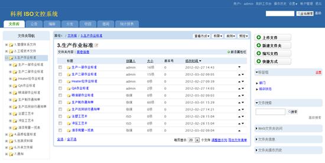

=================================
科利电器厂建立ISO文控系统
=================================

易度 `ISO文控管理系统 <http://www.edodocs.com/solutions/isodoc.rst>`_ 遵循ISO9001标准，对ISO文档的编制、修改、审核、分发、收回、借阅、销毁等流程进行全生命周期的电子化管理。

**企业决策背景**

科利电器厂是集开发设计、零部件制造、生产组装、产品试验到交货为一体的制造工厂，期间会不断产生并积累大量的重要文件。同时，文件管理也变得困难。

- ISO文件资料纸质管理查阅不方便
- 异地工作或者出差导致无法签字审批，审核效率低
- 纸质文件分发收回管理繁琐、难以做到异地分发、容易出错
- ISO文件的变更管理繁琐

**解决方案**

- 建立文件库，集中管理体系文件、培训资料、技术文档等ISO文件
- 电子化管理文件的入库、借阅、统计
- 提供在线预览功能，查看文件更方便
- 控制文件的发布流程，包括起草、审核、培训、更新等
- 控制文件的分发和收回流程，保证文件安全并有效利用
- 提供电子签章功能，实现版权保护

   

**实施效果**

- 全面把控ISO文件的全生命过程，保证了文件的正确性和安全性
- 在ISO部、QA部、工程部、产品实验室等部门全面推行，超过50多人同时使用
- 异地文档协作和办公，把深圳总部与香港办事处的ISO文档来往联接起来
- 查找文档效率提升5倍以上
- 固化企业的ISO文控体系，辅助ISO文件审核和发布

