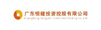

=================================
医药生物行业
=================================

医药生物行业，要求按照GMP规范来严格约束作业，确保生产的安全和产品的质量，易度ISO文控能够很好的帮助医药企业。

上海景峰制药 - 企业文档管理系统
--------------------------------------------------
.. image:: img/jfzy.gif
   :class: float-right

2010年1月23日，上海景峰制药有限公司正式成立。上海景峰制药有限公司致力于中西药和生物制剂产品的生产和经营，为上海市高新技术企业，同时具备药品和医疗器械（三类）生产许可。
我们现有的治疗领域的产品是：心脑血管类、神经内科类、镇痛类、骨科（关节炎）类、风湿骨病类。其中心脑血管类达到占有率中国第一，玻璃酸钠制剂产品占有率中国第二。 

广州润普 通过成熟的易度文档管理系统产品为上海景峰制药构建企业文档管理系统，集中存储和管理上海景峰制药的医药产品文档、研发文档等文档资料，通过权限控制让一般职员只查看文档，不可下载带走。 
防止文档资料外泄。

上海来益生物药物研究开发中心-医药研发文档管理系统
---------------------------------------------------
.. image:: img/logo-shly.gif
   :class: float-right

上海来益是浙江医药股份有限公司于2010年1月日在杭州与中国药科大学、北京大学药学院和自然人金志华博士等签署了共同发起设立的.中心主要是开展具有自主知识产权的生物药物产品的研究和开发，同时将作为硕士、博士培养基地.

广州润普为上海来益公司提供医药研发项目管理和文档管理系统,在中心内部建立起研发项目的监控跟踪系统和研发相关的资料库,为各个项目成员提供详细的任务分配和项目跟踪信息,节约沟通的成本,促进中心内项目协作的稳定发展. 同时,为医药项目的文档提供一个安全可靠的保险箱,根据细致的权限进行划分人员的权限.防止研发资料泄密.

合肥立方制药股份有限公司
---------------------------------------------------

合肥立方制药股份有限公司是一家以药品研发、生产、销售和提取分离为一体的股份制医药产业企业，旗下拥有多家生产企业和一家医药销售企业。员工共有700余人，已取得非洛地平等近百个药品生产批文，总经销、代理、配送上千种品种规格的药品，同时建立了覆盖全国的终端推广网络。为安徽省创新试点企业。公司先后获得高新技术企业、合肥市创新型企业认证。2012年，“立方”商标被认定为中国驰名商标。 

针对立方制药功能需求，润普公司推荐使用润普档案管理软件。对于文档实现集中存储统一管理。六层七级权限划分严密控制每一份文档的查看、下载权限。系统提供全文检索、条件组合检索帮助快速查找文档。独立的协作空间，可以在项目里、部门里进行协作，创建、分享文档。档案归档、借阅流程审批自定义，快速实现电子化办公审批。

广东恒聚医疗科技有限公司
---------------------------------------------------

广东恒聚医疗科技有限公司，成立于2011年。是广东恒健控股有限公司和香港高龄国际公司出资成立的合资企业，恒聚致力于国际先进的高端放疗设备的研发制造和产业化工作。专门从事质子肿瘤治疗设备研发制造及其产业化项目的运营。自公司成立以来。质子肿瘤治疗设备产业化项目得到了省委、省政府领导的高度评价和大力支持。是国家战略性新兴产业聚焦发展试点重点项目、广东省重点建设项目、广东省现代化产业500强。 

润普公司根据恒聚公司自身要求，在润普文控理软件产品基本功能上对于企业需要扩充的功能，进行定制开发。润普ISO文控管理系统包括文档编审、文档分发、文档回收、文档借阅在内的功能控制上对ISO文件体系文档进行全生命周期的流程管控。自定提醒功能需要通过定制开发也实现使用。

佛山顺德恒健强子医疗科技有限公司
---------------------------------------------------

佛山顺德恒健强子医疗科技有限公司是广东恒健核子医疗产业有限公司的全资控股公司。是顺德区政府及广东省政府重点支持的科技企业，是一家集研发、生产、技术咨询等为一体的医疗设备研发公司。公司斥巨资建设质子和重离子肿瘤治疗技术产业化项目，将致力于质子和重离子肿瘤治疗装置产业化项目的各项工作。

广州润普根据广州恒健强子公司的需求，在润普文控管理软件的基本功能上对于企业需要扩充的功能进行定制开发，进行对ISO文档的全生命周期管理，保证了文档的有序管理和受控，方便了文档的查找，降低了质量事故的发生率；组建了一个统一的办公平台，加强了项目协作；支持文档在线共享和审核，支持全文检索等检索功能；通过软件系统固化了研发流程，减少了新员工适应研发工作的时间，提高了公司的工作效率。

