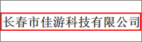

`263网络通信 - 企业内部知识库`_
-------------------------------------
.. image:: img/logo-263wl.gif
   :class: float-right

263网络通信是中国最早最具实力的互联网接入服务提供商之一、中国最大的专业电子邮件运营商、首批拥有多方通信许可牌照的10家企业之一、国内首批拥有IP-VPN许可牌照的5家企业之一。

广州润普为263网络进行构建企业内部知识库，把数据文档安全可靠地集中管理起来，便于检索和应用。使用系统中提供的文档协作和应用功能，可把文档管理从单纯的数据管理升级至知识管理层面。

`广州网易游戏事业部 - 知识门户`_
--------------------------------------------------
.. image:: img/logo-wangyi.gif
   :class: float-right

网易 (NASDAQ: NTES)是中国领先的互联网技术公司，在开发互联网应用、服务及其它技术方面，网易始终保持国内业界的领先地位。易度知识管理系统主要应用于广州网易游戏事业部。

润普帮助网易构建企业文档和知识门户系统，帮助网易的海量文档和知识资料实现可靠的存储，方便共享和查看。该系统在易度文档的基础上开发完成，涵盖了网易公司产品开发、公司和部门门户、项目管理、知识管理等众多方面，成为网易在线娱乐事业部的主要工作系统之一。

系统于2006年1月开始小范围推广，于2006年4月全面上线，系统用户超过1,000人。

.. _263网络通信 - 企业内部知识库: ./263.rst
.. _广州网易游戏事业部 - 知识门户: ./wangyi.rst

`长春市佳游科技有限公司 - 通用文档管理软件`_
--------------------------------------------------

公司介绍长春市佳游科技有限公司，组建于2006年，自成立以来，已研发了多款精品手机游戏，包括RPG、ACT、FTG、TAB等多种游戏类型。

易度为佳游科技提供一套通过文档管理软件，在公司内部构建起一个以文档为基础的分享协作平台，提高员工工作效率。

.. _长春市佳游科技有限公司 - 通用文档管理软件: ./jiayou.rst
