====================
易度档案管理系统介绍
====================

.. raw:: html

	
	

.. image:: img/edodocs-archive001.jpg

.. sectnum::

|

`**观看视频: 《易度档案管理系统的使用》** <../tour/flash/#id4>`__

-------------------------------------------------------

档案管理系统概述
==========================

.. sidebar:: 相关资源

   - `下载试用版 <../download.rst>`__
   - `在线试用 <http://oc.easydo.cn/archive/@@loginForm.html?camefrom=%2Flogin%3Fservice%3Dhttp%253A%252F%252Farchive.easydo.cn&isdocsdemo=1>`__
   - `快速了解系统功能 <../tour/>`__
   - `《易度档案管理介绍》 <http://download.zopen.cn/releases/docs/易度档案管理系统介绍.pdf>`__

易度档案管理系统是广州润普网络科技有限公司专门为档案管理设计开发的软件系统，遵循国家档案局《归档文件整理规则》内容和集中统一管理档案，维护档案的完整与安全，便于利用的原则。它具备高效、高质、简单、实用的特点。

使用易度档案管理系统，可全面管理电子档案资料 ，从电子档案的收集、入库、整理、发布、归档、查询、借阅、销毁等方面进行全过程控制和管理，实现档案信息管理传输的自动化、档案资料一体化、标准化、规范化和共享化。

易度档案管理系统广泛应用于以下行业：国家政府机关、能源部门（电力、石油石化、煤炭）、水利部门、冶金部门、铁路部门、通信行业、机电兵船行业、交通、金融保险、建设行业、图书馆、档案馆以及中大型企业。

档案管理的现状及问题
===========================
传统档案管理以纸质管理为主，纸质文档保存、借阅、管理不方便，容易损坏泄密。信息化时代急需提供电子档案的管理，企业大量电子文档、照片、音频、视频等电子资料和数字资产，但是缺乏有效的管理方法。

如何确保海量档案资料安全？如何更好的发布档案信息，便于查找和使用？如何兼顾档案文档的电子化管理和纸质管理？如何更好地对档案管理工作进行评估和管理？等等一些问题，都是需要去解决的。

易度档案管理解决方案
==============================
针对目前档案管理的现状与问题，广州润普提出了电子档案的规划、入库、查找、借阅、发布、监管的完整信息化方案。

- 建立可靠的海量电子档案库，能和纸质档案关联
- 建立电子化流程，支持档案借阅、发布等管理
- 提供多种途径，在线档案检索
- 更友好的档案专题发布，建立档案的关联，方便知识的获取
- 提供各种统计报表，方便对档案管理的评估管理

电子档案库介绍
=========================

建立电子档案库
-------------------------
将档案集中统一管理，建立一个高效实用的档案库。自定义各档案文件夹的名称、属性、档案编号等，还可以添加备注说明信息。

旧有的纸质档案数字化，现有的电子档案合理化。

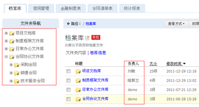

上图中，文件夹对应卷库和案卷，分别设定负责人管理人员，分层组织管理

档案资料的收集入库
----------------------------------
支持多种途径上传档案，档案资料批量入库

- 浏览器批量上传
- Windows拖放上传（web文件夹功能）
- 海量数据初始导入

下面是通过web文件夹拖放上传的示例：

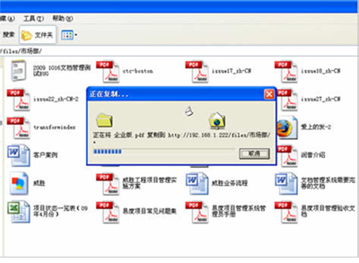

入库流程和状态变迁
--------------------------

从上传到正式的发布，系统都制定的相应的规范流程，保证档案的正确性和可用性。

1. 档案整理人，上传档案（草稿状态）
2. 补充各种元数据
3. 通知档案管理员审核（待审状态）
4. 通过审核，档案发布（发布状态）

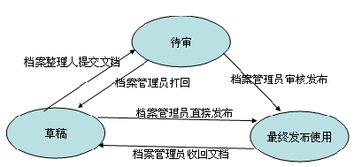

入库审核流程
--------------------------------
支持两种文档入库审批流程，规范化日常档案入库流程。

档案文件属性
-------------------
每个档案文件包括一组属性，用于补充说明文档，同时可根据这些说明文字进行搜索。

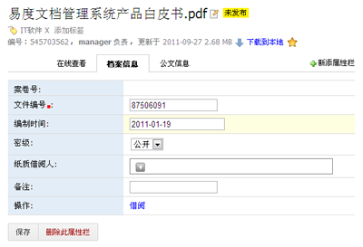

档案库的权限控制
---------------------
设置档案库的安全策略，保证正确的人访问正确的档案资料

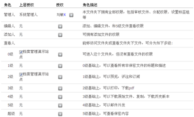

OCR智能识别和转换
=====================
易度档案管理系统采用自动OCR识别技术，把档案扫描件自动进行文字分拣和处理。同时，可把档案原件直接转换成双层PDF文档，实现无差别转换，同时，也方便了查询。

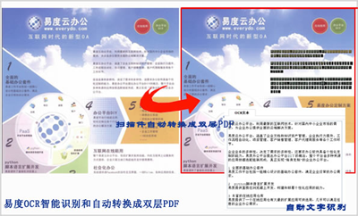

档案库的使用
===================

档案资料发布
--------------------
更友好的展示档案库资料，方便查找使用

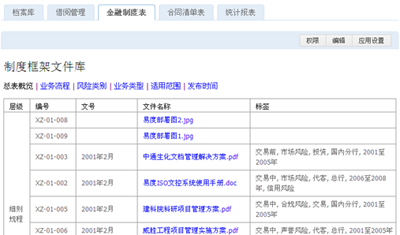

档案资料快速检索
-----------------------
拥有全文检索、组合搜索、跨库搜索、文件夹内搜索、标签组筛选等检索功能

.. image:: img/archive-img016.png
   :alt: 搜索：全文检索、组合搜索、跨库搜索、文件夹内搜索等检索功能
   :width: 480px

标签组管理
---------------------------
系统默认提供“部门”、“密级”、“保存期限”三项标签组，所选标签会自动关联到扩展属性当中

用户可自定义添加更多标签，可用于档案的分类管理和搜索

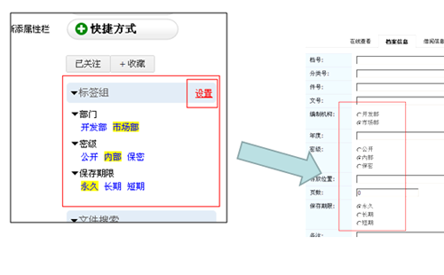

档案资料在线预览
-------------------------
可预览超过100种格式的电子档案资料，实现高保真的预览查看效果。

预览office文件
......................
直接在浏览器中查看各种格式office文件，边看边加载，快速高效

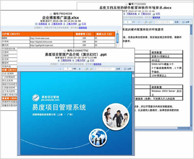

预览图片
...............
缩略图预览，支持相册播放

.. image:: img/archive-img022.png
   :alt: 档案库在线预览图片
   :width: 400px

预览CAD图纸
....................
无需安装任何其他插件，直接图片方式快速查看CAD图纸，提供缩略图

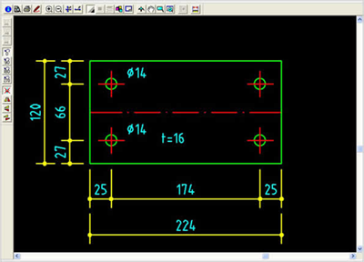

预览3D图纸
...................
使用IE浏览器，并安装 eDrawing ，可实现在线查看3D图纸

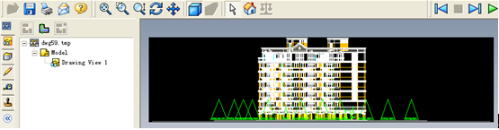

档案借阅
----------------
系统同时支持电子和纸质档案的借阅。电子借阅到期后，系统会自动收回档案。系统会将申请自动递交档案库管理员审批，也可以自定义档案的借阅流程。

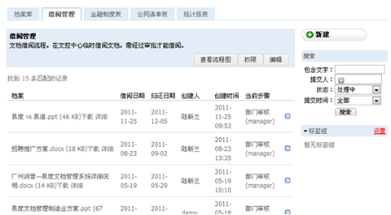

数据统计和报表
=========================
易度档案管理系统当中，提供各种统计报表，方便对档案管理工作的监控、评估和管理

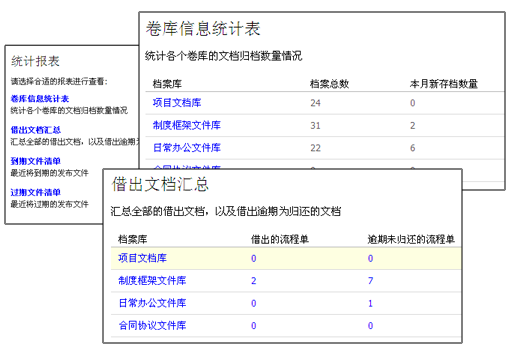

档案资料的安全防护
=============================

操作日志
------------------
记录系统各种操作痕迹，做到出现问题，保证可追溯

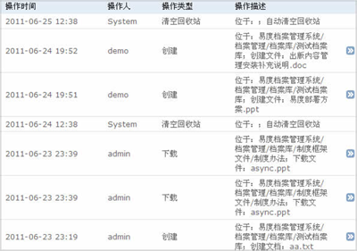

档案资料的存储还原备份
----------------------------------

文件直接存放在文件系统中，提供数据的自动备份：每日每周定期备份，也可手动备份，增量备份，另外，也可以精确选择时间手动还原

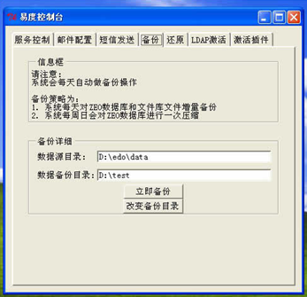

