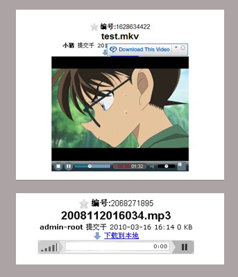
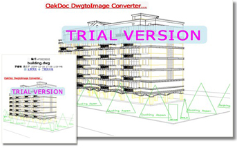
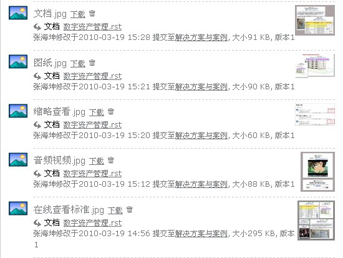
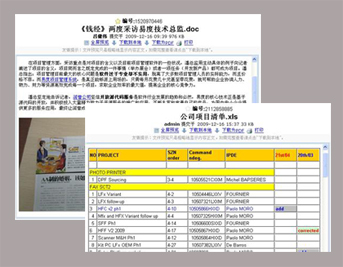
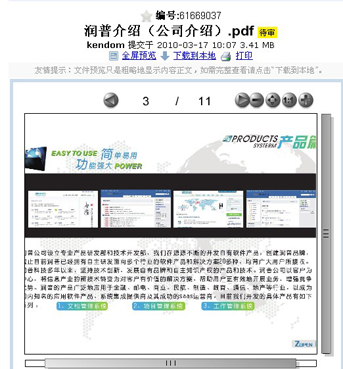

==========================
数字资产管理
==========================

.. sectnum::

你需要数字资产管理吗
========================================

在信息社会中，无论是做设计、制作、出版、印刷、包装等工作，还是做多媒体、广告、动画、广播、电视等工作，我们可能每天都会与数以千计的数字资产打交道，包括大量的图片、声音、影像、数据表、广告、幻灯片等内容。特别是由于网络的应用、跨媒体出版的实现，许多公司持有数字资产的数量正在急剧增加，面对数量和价值都无法估量的数字资产，如何实现其数字化、如何进行管理、如何高效应用，这个问题正成为企业管理者们越来越紧迫的挑战。

易度发布的数字资产管理解决方案正好能够满足当前国内企业对数字资产管理的需求，帮助企业用户快速并轻松地整合数字资产管理流程，提高数字资产利用率，并大大降低管理成本。

----------------------------------------------

易度数字资产管理
================================================

系统支持各种图片、模版、多媒体、影像、声音和文字文件直接在浏览器中查看或者播放，无须任何插件，用户体验更易用、更直观，使用非常方便。

音频、视频的在线播放
-----------------------------
支持音频、视频的在线播放；音频和视频无需插件自动转换为flv和mp3格式，采用flash播放，构建您的企业视频分享站点。

各种图片的在线查看
-----------------------------
支持各种图片在线查看，对于AutoCAD图纸，系统可自动生成一个图片，方便用户快速在线预览查看，有了它，图纸查找从此轻松。

图片缩略查看
-----------------------------
用户上传的图片，可以自动生成缩略图显示，避免图片过大导致下载速度缓慢，影响查看的感受。系统采用PIL (www.pythonware.com/products/pil/) 实现。支持各种常用的图片格式，如.jpg、.gif、.png、tif、 bmp等。

文档在线预览
-----------------------------
系统支持常见文档转换为html格式，直接在网页上进行预览，用户无须安装任何桌面软件，便可查看文档内容，帮助构建您的企业豆丁图书分享站点。系统采用插件架构，可方便扩展支持其他的格式。    

PDF在线查看
-------------------------------
PDF可转换成flash进行预览，查看效果更直观，用户体验更高。

