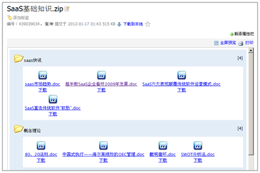

===============
企业文档管理
===============

.. raw:: html

	
	

.. sectnum::

.. sidebar:: 相关资源

   - `下载试用版 <../download.rst>`__
   - `在线试用 <http://dms.oc.easydo.cn/@@loginForm.html?camefrom=%2Flogin%3Fservice%3Dhttp%253A%252F%252Fdms.easydo.cn&isdocsdemo=1>`__
   - `快速了解系统功能 <../tour/>`__
   - `《企业文档管理介绍.pdf》 <http://download.zopen.cn/releases/docs/%E6%98%93%E5%BA%A6%E6%96%87%E6%A1%A3%E7%AE%A1%E7%90%86%E4%BA%A7%E5%93%81%E4%BB%8B%E7%BB%8D.pdf>`__

易度文档管理系统基于知识管理的理念，开发的一套用于企业文档资料管理、知识管理的软件系统，帮助企业进行文档的全生命周期管理。

通过易度文档管理系统，企业可以解决文档的存储、安全防护、查找、协作、发布等方面的问题。

企业文档管理的六大问题
======================================
企业通常采用光盘、移动硬盘、共享文件夹、U盘存储文件，通过邮件、即时通讯等进行文档传递。

这种模式下存在诸多问题：

- 文档缺乏集中存储

  文档集中存储是文档管控的基础。企业海量文档分散在不同部门，甚至个人手中，难于查找、控制。

- 文档安全难以保障

  常用存储介质都无法做到永久存储，数据容易丢失; 文档权限控制繁琐不清晰，容易泄密; 纸质文档的抗灾难性差

- 文档版本管理混乱

  文档修改过程中，会出现大量传递情况。个人通过邮箱或者即时通讯工具，得到多个版本的文件，难以找到正确的版本。

- 查找缓慢，效率低下

  因为缺少有效的搜索工具，每天需要花大量的时间去查找文档资料

- 企业有限的带宽被邮件附件占用

  一旦群发邮件带有附件，附件被传递到公司所有人员的桌面邮件系统，导致互联网带宽被占用

- 文档无法有效协作

  文档审核流程复杂，无法实现自动化管理; 缺乏高效的共同编写文档方式（合同、解决方案等)

- 知识管理举步维艰

  员工离职，交接不全，带走了企业的知识（人才流失=知识流失）;  企业内部缺少分享经验和共享知识的环境和氛围; 知识沉淀、挖掘、清理，缺乏电子化工具

易度企业文档管理解决方案
==================================================
针对上述问题，结合文档管理系统，易度提出了相应的解决方案

- 易度文档管理系统建立中心文档库，实现企业文档管理制度化；
- 采用 “四层六级”的权限体系数据容灾存储，记录文档使用痕迹；
- 提供文档版本管理和发布流程控制，涵盖编写、审核、发布、更改等各环节；
- 提供毫秒级的全文搜索，可以多维度组合搜索，省时、高效；
- 以文档为中心的多人协作环境沟通更直接、更高效；
- 易度建立企业知识体系和脉络；通过多种沟通渠道，挖掘、传播隐性知识

文档的安全和防护
============================

严格的文档权限管理
---------------------------
- 支持授权委托管理，可单独针对各个文件夹指定文件夹管理员，文件夹管理员在该文件夹下拥有全部管理权限
- 支持成组授权，针对某个部门、某个岗位进行授权
- 支持负授权，禁止群组中的特定成员用户的权限 
- 支持6级查看人权限，可单独对文档的查看、下载、打印、修改、删除等权限进行控制，严防泄密
- 支持权限继承，子文件夹自动继承上级授权，也可禁止上级授权
- 具备文档保密性控制功能，保护核心文档

完整的文档操作历史记录
------------------------------
- 可以记录文件或文件夹的操作历史，包括文件或文件夹的创建、编辑、版本、流程、打印等
- 所有删除文件都会自动进入回收站，通过操作历史的查询，可以还原已经删除的文档
- 同时也会记录系统的操作历史，便于系统管理员检查系统，避免出现问题

文档在线查看预览
=======================================

在线查看办公文档
------------------------------------
- 系统支持Office 2003 、Office2007、WPS、PDF等办公文档的在线预览和全屏预览
- 系统可自动生成PDF，同时保存原文件和PDF文件，并提供下载

.. image:: img/edm-img003.png
   :width: 440px
   :alt: 在线查看办公文档

在线查看AutoCAD图纸
------------------------
- 无需任何插件，AutoCAD图纸可以直接在线预览

在线查看2D/3D图纸
-----------------------
- 使用IE浏览器，并安装 eDrawing ，可实现在线查看3D图纸

.. image:: img/edm-img005.png
   :width: 555px
   :alt: 在线查看2D/3D图纸

在线播放流媒体
----------------------
- 系统支持各种格式的流媒体（音频、视频）在线播放

.. image:: img/edm-img006.png
   :alt: 在线播放视频

.. image:: img/edm-img007.png
   :alt: 在线播放音频

在线预览图片
-----------------------
- 可以缩略图预览，支持相册式播放

.. image:: img/archive-img022.png
   :width: 370px

在线查看压缩包
-------------------
- 无需安装插件，系统支持在线查看压缩包里的文件文档

创建快捷方式
------------------------
- 可在其它目录或文件夹中创建一个快捷访问图标，类似电脑的桌面快捷方式
- 免去文件产生过多副本，节省空间
- 原文件与快捷方式文件的修改是同步的

.. image:: img/edm-img009.png
   :width: 247px
   :alt: 文档快捷方式

关联文档
------------------
- 文档之间可以相互关联，快速查看更多相关文档
- 可以将关联和文档定义为附件关系

.. image:: img/edm-img010.png
   :width: 200px
   :alt: 关联文档

解决文档协作问题
==============================

在线编写文档
---------------------------
- 无需安装程序，可在系统中直接创建html、txt、rst文档
- 可直接在线修改此类文档，提供锁定保护

.. image:: img/edm-img011.png
   :width: 400px
   :alt: 在线编写文档

在线修改文档
---------------------------
- 只需要安装易度的外部编辑器插件就可以在线修改文档
- 文档修改时自动加锁，防止多人同时修改的情况
- 保存后，文档会自动上传至服务器中，并覆盖原文档或创建新版本

.. image:: img/edm-img012.png
   :alt: 外部编辑器在线修改文档

提供强大、易用的版本管理
-------------------------------
- 文档一旦定版，后续的修改，将自动保存为新版本
- 版本版次自动维护，上传新版本的时候，系统自动推荐一个版本版次。用户也可以手动进行调整
- 提供版本差异比较，所有可以在线预览的文档，均可支持在线版本差异比较
- 提供文档历史版本的下载

提供文档评注和订阅功能，帮助企业员工协同共享文档
-----------------------------------------------------
- 可关注文档，或者将文档分享给其他用户
- 可直接发表评注，表达观点，动态订阅相关的文档
- 可在评注当中添加上附件，令其更加直观
- 支持三种通知方式：系统消息通知、电子邮件通知和手机短信通知

提供强大快速的搜索功能
===================================

支持全文检索，多组合的高级搜索功能
---------------------------------------
- 可根据文件正文内容信息精确搜索到相关文档
- 支持全文检检索的类型：.doc,.rtf, .xls, .csv, .ppt, .pdf, .txt, .htm, .html, .xml, .rst
- 可根据文档的标题、正文内容、文档标签、创建人、创建时间、修改时间、文档编号、关键字、格式、状态等进行搜索。

.. image:: img/archive-img016.png
   :width: 400px

通过标签组进行搜索
-----------------------
- 可管理、多层次、多维度的标签分类机制
- 可通过标签组快速查找到相关的文档，一个文档可添加多个标签

.. image:: img/archive-img017.png

提供收藏夹功能
-------------------------
- 收藏一些常用的、关注的文档，并通过文档标签功能进行个人知识管理
- 可以通过收藏夹方便快捷地进行文件查找和定位 

