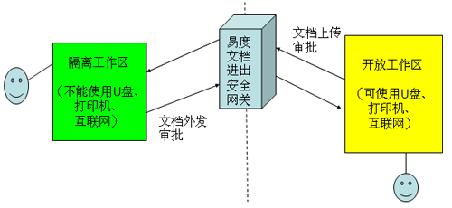
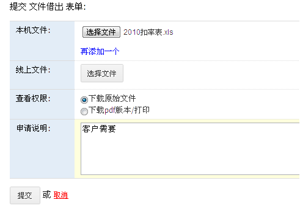
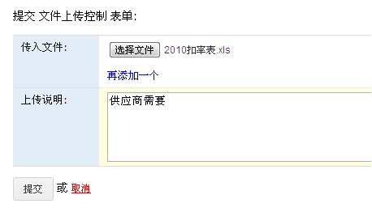
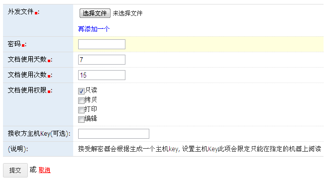

========================================
文档进出安全网关
========================================

.. contents::
.. sectnum::

安全网关概述
---------------------
出于安全考虑，防止机密文档的外泄，众多的企业都禁止员工使用U盘，甚至禁止外部网络访问。这些传统的保密方案，却很大程度地影响了企业的日常办公运作。

企业如何控制文档的进入和外发传出？

易度进出口网关，通过文档进出安全网关，利用严格的电子化审核机制，控制企业文档的进出安全。

其中包括三个核心的文档审批流程

- 文档借出审批
- 文档传入审批
- 文档加密外放审批

文档借出
---------------------
隔离工作区提交申请并上传文档，审核通过后，在开放工作区可下载文档

文档传入
---------------------
在开放工作区选择需要上传的文档，并提交申请，审核通过后，该文档可下载进入到隔离工作区

文档加密外发
---------------------
在隔离工作区选择需要外发的文档，审核通过后，文档自动加密，并外发

我的工作台
---------------------
在工作台中，可查看与自己相关的申请流程，并快速审核处理

文档交换区
---------------------
用于临时存放上传、外发的文件

