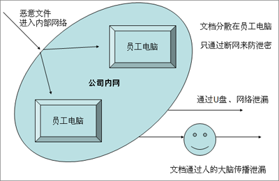

.. sectnum::

===================================
　文档安全管理
===================================

.. sidebar:: 相关资源

   - `下载试用版 <../download.rst>`__
   - `《文档安全管理介绍》 <http://download.zopen.cn/releases/docs/%E6%98%93%E5%BA%A6%E6%96%87%E6%A1%A3%E5%AE%89%E5%85%A8%E7%AE%A1%E7%90%86.pdf>`__
   - `快速了解系统功能 <../tour/>`__

重金开发的系统代码被辞职员工拷贝带回家？苦心设计的文档、图纸被内部不良员工泄漏到竞争对手那里？信息化的时代，电子文档成为企业知识资产的主要形式。如何防止电子文档被泄密、损坏、被恶意破坏，日益被企业所重视。

易度安全文档管理解决方案，在服务器、桌面、外发、出入、授权等多个环节进行文档安全全面控制的解决方案，确保文档的安全性。

本方案适用于：

- 制造业与军工企业：保护需要共享，但又不希望扩散的文档
- 知识型、技术研发型等科研机构：保护研究报告、技术文件等重要内容的版权
- 专业事务所：如律师事务所、投资银行机构等与其客户相关的众多文件
- 政府、军队：政府公文、军事情报等涉及国家机密的信息

现状及问题
=====================
目前，企业单位的文档资料大部分都分散在员工的个人电脑上，这样，企业电子文档安全防范分散到个人上。整个安全防范水平，取决个人的安全防范意识。

安全管理靠个人，导致整个企业文档安全难以控制，难以进入一个高的水平：

- 桌面存储不可靠

  个人电脑硬盘容易出现故障，感染病毒，又或者操作失误，不小心删除了重要文档

- 桌面文件难以防泄密

  文件保密性不高，轻易就泄密或被盗，如通过U盘或网络发送等方式盗取

- 危险文件进入难防范

  恶意文件/病毒通过U盘、光盘、网络轻易进入系统，破坏了安全体系，导致文档数据丢失，整个系统不能正常运行

- 外发文件容易泄密

  与合作伙伴的沟通协作过程中，对被其带走的机密文件失去了监管能力，不能保证信息安全

- 文档授权控制缺少有效工具

  普通员工都可以轻易接触到一些机密文件，可以查看甚至利用U盘等工具将其盗走

- 文档安全管理难监管

  操作历史记录难以记录，无法对文档安全情况进行监视，不能对安全事故进行分析、追溯

解决方案
======================
针对上述问题，易度文档安全管理解决方案，建立在文档集中统一管理的基础之上，在服务器端、桌面、外发文档、文档出入、员工授权等多个环节进行控制，全面解决企业文档安全的问题。

.. image:: img/leakprotect-img005.png
   :alt: 文档安全管理解决方案

在这个方案中，文档集中管理是基础. 企业的大部分文档，不在存放在安全薄弱难以控制的个人电脑上，而是存放在服务器端，由易度文档管理系统来进行统一管控。

个人桌面不存放数据，或者仅存放少量数据。这样可以避免文档多处重复存储，意味着泄漏风险点的减少.

同时易度在文档管理各个环节进行控制，具体包括：

#. 服务器文档安全保护
#. 文档授权控制
#. 终端文档防泄密
#. 文档出入控制
#. 外发文件防泄密控制

服务器端文档保护
===========================
文档集中存放在服务器端，因此服务器端文档的安全管理成为系统的安全基础。

安全存储与备份
-------------------
文档存放在服务器端，能够确保存储的可靠性，避免因各种意外而丢失：

- 简单存储，文件访问不依赖软件，数据不会因软件故障而无法访问
- 磁盘推荐采用 RAID 阵列磁盘，即使部分磁盘损坏，数据也可得以恢复
- 数据自动备份，可恢复至历史备份
- 删除文件自动进入到回收站，可还原

文档防盗取
------------------------------
文档存放在服务器端，服务器成为防泄密的高危点。

易度提供专业的服务器端防泄密软件，提供服务器端防泄密控制。

具体功能：

- 禁止用户访问关键数据区
- 屏蔽U盘拷贝
- 双密码2层保护，缺一不可，堵住最后的泄密可能

  - 只有IT人员拥有服务器进入密码
  - 业务领导应用数据访问密码

授权访问控制
===============
普通用户通过浏览器访问易度文档管理系统，这是访问文档的唯一通道。

易度文档管理系统，为每个用户开设一个帐号，密码验证后，才能登录。系统根据识别的用户身份，提供授权访问的信息。

文档传输采用https加密传输，避免信息在传输过程中泄密。

提供多种授权手段，将企业文档管理制度在系统中固化。

文件夹委托管理
    可为每个文件夹指定单独的管理人员，全权负责文件夹的管理。

    这样可以避免系统管理员负担过重，也可防止系统管理员查看保密内容而泄密。

文件夹授权
    可整对整个文件夹进行授权，子文件夹自动继承上层文件夹的授权，也可屏蔽上层授权。

成组授权
    可针对部门，针对岗位，成组授权。成组授权可简化管理，新员工只需设定岗位，便可拥有相关权限。

6级细粒度查看权限
    查看权限控制非常精细，除了原文下载、外发、保密查看这些高等级权限外，还可控制:

    - 仅查看标题、描述：深入查看需要配合借阅流程
    - 在线预览：可方法文档下载后泄漏，同时确保查看最新版本
    - pdf下载：pdf只读，防止文档被纂改后传播

根据IP地址授权
    可根据机器的物理IP地址，限定访问机器的权限

基于状态的自动权限保护
    “保密”文件一般人员无法查看，受控文件夹下的文件必须进入“发布”状态才可以被看到

终端文档防泄密
======================

企业通常使用断网、禁用U盘这类方式来控制个人电脑的防泄密，但这样同时也影响了日常办公和学习，并且难以控制外部电脑的网络接入

易度文档安全管理系统，包括一套防泄密软件，可以更好的解决桌面防泄密问题

服务器端设置防泄密安全防护模式
    - 普通的web浏览器无法访问
    - 必须通过防泄密浏览器才能访问

终端桌面建立防泄密安全沙盒
    - 从服务器下载的文件，直接进入防泄密安全是沙盒，进行安全防护
    - windows资源管理器无法访问防泄密安全沙盒
    - 必须通过防泄密资源管理器才能访问

使用易度的桌面防泄密软件，可以实现：
    - 全透明加密，不影响员工工作效率和习惯；
    - 允许受限上网，能上网查资料但不泄密
    - 可以保护所有文件格式，包括所有文档格式，所有源代码格式，图纸格式；
    - 安全稳定，不破坏文件；

文档出入网关
====================
出入网关专门针对于文档进出的网络审批关口，是一台独立的服务器。

- 文件上传后，审批通过后，才可在内网下载使用
- 提交输出申请，审批通过后，才可从出口机拷贝输出

文档外发防泄密
======================
外发的文档，为了能够继续进行防泄密控制，通常需要预先通过外发流程进行预先加密处理。

- 文件外发申请流程，能自动实现文档加密

- 使用加密文件，需要安装一个查看器，能对外发文件进行控制

  - 限制打开次数
  - 限制打开时间，具体控制文档的查阅时间
  - 限制打开机器，如：只能通过IE浏览器打开查看
  - 提供密码保护
  - 设定外发收件人的使用权限：打印、查看、编辑等

安全审计
===================

系统提供三级操作日志
----------------------
系统提供完备的操作历史管理，包括:

- 单独查看某个文件的操作历史
- 查看整个文件夹的操作历史
- 查看整个系统，所有用户的操作历史

权限报表
--------------------
可以总览文件或文件夹的权限情况，查看某一员工对于某文件或文件夹的权限。

电子签章
=================
系统可以轻松和电子签章系统整合，确保文档电子签章的合法性.

