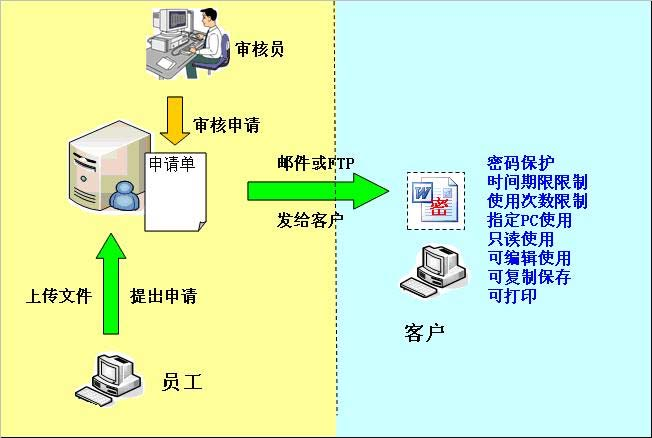
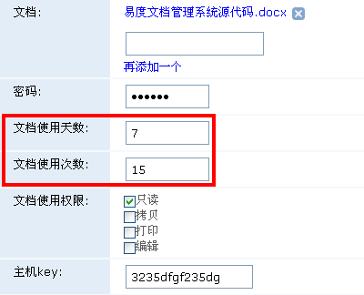
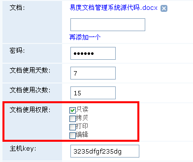
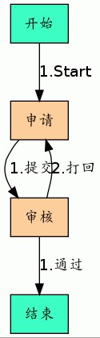
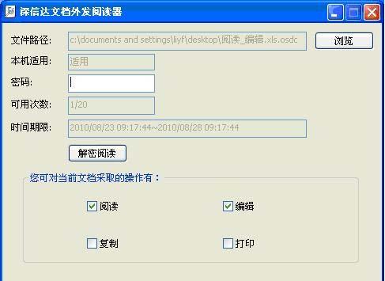
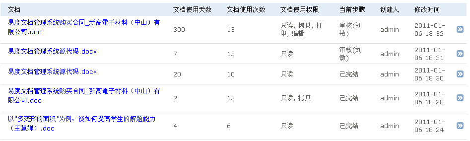

==========================
易度文档加密外发控制系统
==========================

.. sectnum::

问题
===========
在现在的信息时代，企业之间的竞争归根结底是技术实力的竞争，核心资料的保护就成了
企业知识产权保护的重要工作。企业内部往往使用各种措施来防止企业内部员工泄密的情
况发生，但是由于业务的原因，企业会碰到需要将一些重要的图文档解密后发给协同厂商
、客户以及合作伙伴，就会担心这些文档将不会受控制，被任意拷贝，转发，传播，扩散
，从而给企业造成麻烦甚至不必要的损失。因此，如何确保机密数据在企业外发后依然可
以处于安全控制状态，是企业所必需解决的安全管理问题。

概述
=========

易度文档外发控制系统是广州润普网络科技有限公司根据企业在外发文档加密、文档外发
控制方面的需求进行设计开发的软件，主要针对外发给客户、供应商或者合作伙伴等的重
要文档进行合理的控制，更好地帮助企业对外发文件进行有效地安全管理和控制，从而实
现企业文档的保密控制、防扩散和安全协同。

易度文档外发控制系统主要解决以下几个问题。

- 外发文档加密控制
- 外发文档防拷贝
- 外发文档传播控制
- 外发文档防扩散
- 外发文档流程审批

系统架构
===========
易度文档外发管理系统是基于B/S结构开发，采用web方式进行流程操作。实际部署时只
需要进行外发服务器的安装即可，功能操作时只需通过IE浏览器登陆系统，根据用户的
权限不同进行外发申请、外发审批和外发审计等工作。

功能介绍
===========

严格控制外发文件使用期限
-------------------------------
根据申请人所提交的授权规则自动制作可控的外发文件，实现外发文件的控制：

- 时间可控：控制外发文件在合作伙伴处的使用时间。一旦超过限定时间，该文件无法正
  常使用，直接表现为打开即乱码或无法打开。
- 次数可控：控制外发文件在合作伙伴处的打开次数。一旦超过限定次数，该文件无法正
  常使用，直接表现为打开即乱码或无法打开。

严格控制外发文件使用权限
------------------------------
严格控制外发文件在协作厂商处的操作权限：

- 操作可控：任何外发文件只有指定的合作伙伴能够对其进行操作，其它协作厂商均无法
  打开该文件。
- 修改可控：控制外发文件是否允许合作伙伴对该文件进行二次编辑。未经授权，文件只
  能读取不能修改。
- 打印可控：控制外发文件是否允许合作伙伴对该文件进行打印，未经授权，客户无法对
  该文件进行打印操作。

灵活自动的审批流程
-------------------------
 - 灵活自定义审批流程：可依据企业业务需求，灵活定义流程系统，实现单级审批或者多
   级审批，同级别审批者可以在特殊情况下相互委托审批。
 - 全自动的审批过程：只需定义审批流程，后续的申请、审批、制作等过程都将由系统在
   后台自动完成，避免了更多人涉及到明文。不仅简化了文件外发过程，而且增强了系统
   的安全性。

安全的外发浏览器
---------------------
外发加密的文件，需要安装指定的文档阅读器才可以打开。同时，需要进行各种控制参数
的匹配才可以解密阅读等。

|

+--------------+-------------------------------------------------------------------------------------+
|    密码      | 设定该文档的阅读密码，合作伙伴拿到了该外发文档之后，必须输入密码才能解密。          |
+--------------+-------------------------------------------------------------------------------------+
|  可用次数    | 设定该文档的可用次数，客户拿到该文档之后，只能在使用次数内使用。                    |
+--------------+-------------------------------------------------------------------------------------+
|  时间期限	   | 设定该文档的可用时间，客户拿到的该外发文档，只能在指定的时间内使用。                |
+--------------+-------------------------------------------------------------------------------------+
|  绑定PC      | 设定该文档只能在某台指定的机器上使用。其他 PC无法打开该文档。                       |
+--------------+-------------------------------------------------------------------------------------+
| 文档只读权限 | 该文档只能以只读方式打开，不能被编辑，任何另存，复制等扩散途径都被禁止。            |
+--------------+-------------------------------------------------------------------------------------+
| 文档打印权限 | 设定该文档是否允许打印。                                                            |
+--------------+-------------------------------------------------------------------------------------+
| 编辑修改权限 | 该文档允许用户进行编辑修改，并保存到本地硬板。但该文档仍然受控，不能通过另存，复制  |
|              | 等扩散到其他机器。                                                                  |
+--------------+-------------------------------------------------------------------------------------+
| 复制另存权限 | 允许用户把内容复制，另存。被复制内容以及另存之后的文件，不再做放扩散保护。          |
+--------------+-------------------------------------------------------------------------------------+

外发阅读器支持的操作系统：Windows xp /Windows 7 32bit/Windows2003 server 

全程监控的申请记录
------------------------
强大的审计功能可监控所有用户的外发申请记录，并可随时调阅其申请外发的文件与原件
加以比对，实现实时校核，杜绝冒名、改名等违规发放行为。

丰富兼容的数据接口
------------------------
- 支持任意格式电子文档（CAD、Office、PDF、JPG等）的外发安全控制。
- 支持与易度其他系统无缝集成，配合使用，实现文件“加密”与“外发”全方位的安全保
  护。

