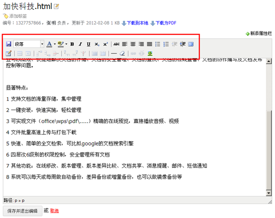
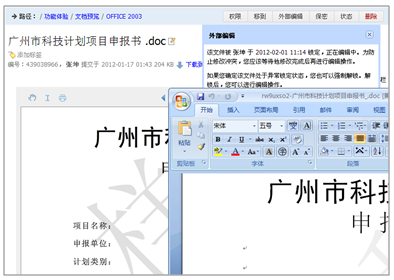
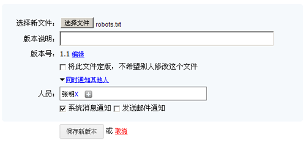
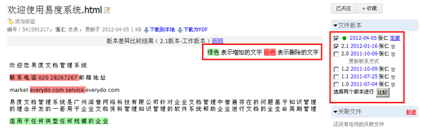
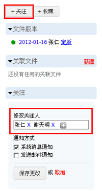
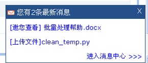
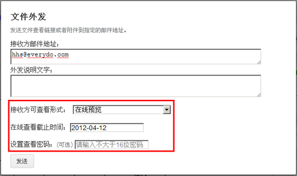
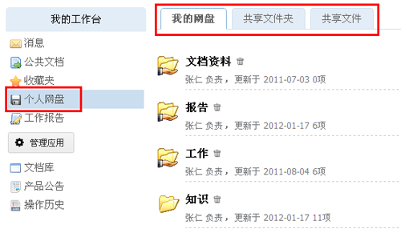

===============================
协作和编写
===============================

.. sectnum::

在线编写文档
--------------------

易度文档管理系统支持在线编写文档功能，无需用户上传、下载，直接可在线进行编写。系统采用开源的TinyMEC编辑器，在浏览器上就可以编写出格式丰富的文档。

外部编辑功能
-----------------
系统提供文档在线编辑的功能，安装“外部编辑器”插件后，可实现文档编辑和桌面编辑器(如word、Excel等)的无缝集成。编辑完成后，外部编辑器会自动在后台将文件上传到服务器，简化了传统的下载、编辑、上传的复杂过程。

无论是在线编写，还是外部编辑，系统都能够自动管理文档的修改锁，避免多人同时修改同一文件发生冲突。可以做到：编辑自动加锁，完成编辑自动解锁；加锁检测和提醒；异常情况下，支持强制解锁。自动的锁管理，让普通编写人员无需理解专业“checkin/checkout”词汇，便可方便的进行编辑操作。

版本管理
===============================

企业在文档版本管理方面通常存在以下问题

- 文档版本繁多，难以整合和统一管理。
- 文档版本无法恢复，造成知识流失。
- 经常出现使用错误的文档版本的现象。

易度文档管理系统提供强大的版本管理功能，帮助企业解决文档版本管理方面存在的上述问题。

文档的版本包括当前版本和历史版本。当前版本是用户当前的工作版本，可以自由进行修改，用于文档需要进行频繁修改阶段，此时文档处于不稳定的编辑状态。而历史版本是已经处于稳定状态的文档版本，历史版本不能进行修改，可以供用户进行下载查看。系统支持版本版次维护功能，版本标示文档大的变化，版次标示文档小的变化，版本版次的作用是对历史版本进行标识。版本版次系统自动生成，用户也可以手动进行调整。另外提供版本说明功能，对历史版本可进行文字说明。

系统提供两种方式用于将当前版本切换到历史版本，一种是通过上传新版本的方式，一种是通过定版的方式。

上传新版本
~~~~~~~~~~~~
通过上传新版本，将当前的版本切换到历史版本。系统自动推荐一个版本版次，用户也可以手动进行调整。

版本历史管理
~~~~~~~~~~~~~~~~~~~~
- 系统提供获取历史版本功能。帮助用户在文档多版本中查找到历史版本，以免造成知识流失。
- 系统支持版本差异比较功能。所有可以在线预览的文档，均可支持在线版本差异比较。 用户可在文档的多个版本中选择两个版本进行比较，版本比较的结果会自动显示，包括两个版本中有增加的文字和删除的文字都会采取颜色对比形式进行显示。
- 系统支持删除历史版本功能。对于用户来说，文档版本繁多，有些历史版本需要进行删除，否则会经常出现使用错误版本的现象。易度文档管理系统提供版本删除功能，用户可方便快捷地将不需要的历史版本进行删除。
- 系统支持定版功能。一旦定版，当前版本进入历史版本，对该文档的任何修改，会在自动生成的一个新的工作版本中进行。

评注
-----

系统支持评注订阅功能，用户可对相关文档、论坛帖子、活动主题等发表评注信息。评注成功后，该文档或帖子的关注用户会收到系统通知消息。

关注
----------

用户可以关注一些常用的或者重要的文档，当文档有改动时，可以更快地获得系统通知。

消息通知
---------------
用户在上传、修改文档或其他操作时，可采取消息通知的方式，告知相关人员关于文档的变更信息。被通知用户可在系统右上角实时查看消息。或者在“我的工作台”中的“消息”模块详细查看

邮件外发
------------
用户可通过采取邮件外发的手段，将自己的文档传递给相关人员查看。可限制其对文档的使用权限、查看时间，并设置使用密码。

文档共享
---------------
用户可将个人区的“个人网盘”查看公司的共享文档或文件夹。

