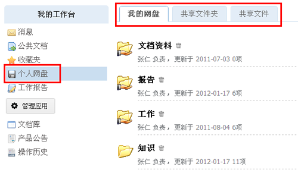

===============================
文档分享和协作
===============================

.. sectnum::

文件分享
------------------------
文件的所有者，可以把文件直接分享给公司其他人员。这省去了邮件发送的诸多不便。

评注
-----

系统支持评注订阅功能，用户可对相关文档、论坛帖子、活动主题等发表评注信息。评注成功后，该文档或帖子的关注用户会收到系统通知消息。

.. image:: pic/authoring-img009.png
   :alt: 对文档帖子的评注、评论

邮件外发
------------
用户可通过采取邮件外发的手段，将自己的文档传递给相关人员查看。可限制其对文档的使用权限、查看时间，并设置使用密码。

.. image:: pic/authoring-img007.png
   :alt: 文档邮件外发，文档加密外发

个人网盘 - 文件夹共享
----------------------
用户可将个人区的“个人网盘”查看公司的共享文档或文件夹。

文档发布
--------------------------------

支持文档审核的一般流程：提交审核—>审核通过—>正式发布，中间可安排众多的审核过程，采用消息通知流程变更。文档一旦发布，禁止再修改。

文档包括草稿（默认状态）、待审、发布、已失效四种状态。

