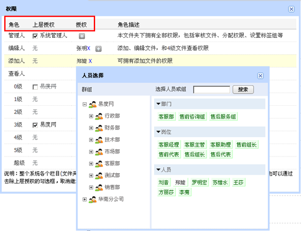
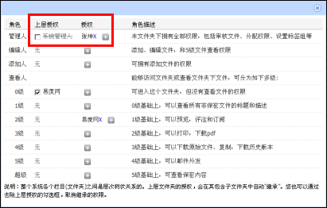
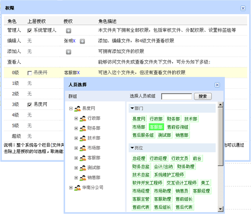

===========================
安全控制
===========================
.. sectnum::

严格的权限管理
===================================================
任何一份文档都会有一定的使用范围和不同用户的使用权限。对此，易度文档管理系统提供委托管理、成组授权、权限继承、四层6级别查看人的权限。根据用户的不同等级、所属部门进行严格的权限划分，分别控制用户的文件查看、下载、上传、修改、复制、移动、删除、发布等权限，从而保证文档在使用过程中的安全。

四层6级别查看人
--------------------------------------------
系统支持四层6级别查看人角色权限，通过不同的角色权限，可以控制文档预览、添加、编辑、移动、复制、下载等权限。 

不同级别查看人拥有不同的权限。如下表所示

授权委托管理
---------------------------------------------
系统支持授权委托管理。可单独针对各个文件夹，指定文件夹管理员，文件夹管理员在该文件夹下拥有全部管理权限，可实现真正的权限委托管理。

禁用系统管理员权限
-------------------------------
对于文件或文件夹，系统管理员的权限可被禁用，前提是管理员已经授权某用户成为文件或文件夹的管理人。对于之前的版本，系统管理员对文件或文件夹都拥有最高权限，且不能被禁用，增设此功能，可以避免IT管理员访问到企业的机密文档数据。

权限继承
------------------------------------------------
易度文档管理系统提供权限继承机制，保证用户在拥有父文件夹管理权限的同时，也将拥有所有子文件夹的管理权限。

成组授权
------------------------------------------------
可针对某个部门、某个岗位进行授权。这样新人到岗，只需指定所在岗位，便可自动得到相应的文档访问权限。成组授权操作简单，只需在权限操作中按群组、部门或岗位进行权限设置即可，大大减轻管理的负担，也可做到控制文档的安全。

文档的保密性控制
--------------------------------------------
系统具备文档保密性控制功能，保护核心文档。文档设置保密后，一般人员将无权进行查看，保证文档的安全性，只有文件夹的管理人、超级查看人、文件的订阅人才可以看到相应的文档。同时支持在文件上传过程中根据用户需要选择是否对文档进行保密操作。

未发布文档的保密性
--------------------------
对于正式的文档，如果没有发布，一般不希望文件夹的查看人查看到。

对于正式文档，可将文件夹设置为受控文件夹，可保证一般查看人无权查看到未发布的内容。 

文档操作历史记录
===================================================
易度文档管理系统对每一个文档、文件夹甚至整个系统的所有操作都会记录到“操作历史”。自动记录每个员工对系统的任何操作，包括文档的创建、下载、打印、订阅、外发、权限变更、删除等。

一般人员仅可以查看自己的操作历史，系统管理员可查看系统所有用户的所有操作历史，一旦出现安全事故，方便进行追查，追溯问题源头，追究事故责任人。

工作时，难免会出现失误情况，可在“操作记录”中，对误删的文档执行“还原”操作。

支持Https安全传输
===================================================
可使用apache的安全传输https的功能，采用网上银行相同的技术，实现文件的安全传输。

|
.. raw:: html

    <h3>详细了解<a href="http://www.edodocs.com/solutions/leakprotect.rst" title="易度文档安全管理">文档安全管理的问题及解决方案</a></h3>

