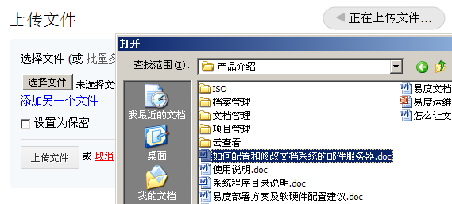
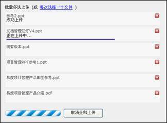
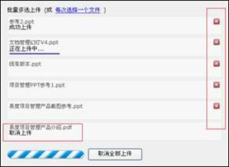
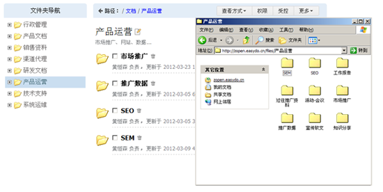

======================
文件上传和编写
======================
.. sectnum::

批量文件上传
--------------------------------------------

用户通常需要进行大批量的文件上传操作，针对用户的这种需求，系统提供了简易高效的批量上传功能。

- 批量多选上传可直接用鼠标左键框定需要上传的多个文件。

- 系统支持在批量上传过程中自动显示上传进度。

- 用户在上传过程中可进行取消操作。

webdav接口
-----------------------------------------

webdav是http协议的扩展，是ftp的一个升级协议。简单的说，它可让web可写。windows等操作系统的资源管理器，天然支持webdav协议。 通过资源管理器，可通过鼠标拖放，实现批量文件的上传和下载。

在线编写文档
--------------------

易度文档管理系统支持在线编写文档功能，无需用户上传、下载，直接可在线进行编写。系统采用开源的TinyMEC编辑器，在浏览器上就可以编写出格式丰富的文档。

.. image:: pic/authoring-img001.png
   :alt: 在线编写文档

外部编辑功能
-----------------
系统提供文档在线编辑的功能，安装“外部编辑器”插件后，可实现文档编辑和桌面编辑器(如word、Excel等)的无缝集成。编辑完成后，外部编辑器会自动在后台将文件上传到服务器，简化了传统的下载、编辑、上传的复杂过程。

.. image:: picture/tour-img011.png
   :alt: 文档外部编辑器-在线编辑文档

无论是在线编写，还是外部编辑，系统都能够自动管理文档的修改锁，避免多人同时修改同一文件发生冲突。可以做到：编辑自动加锁，完成编辑自动解锁；加锁检测和提醒；异常情况下，支持强制解锁。自动的锁管理，让普通编写人员无需理解专业“checkin/checkout”词汇，便可方便的进行编辑操作。

.. image:: pic/authoring-img002.png
   :alt: 文档编辑-强制解锁
