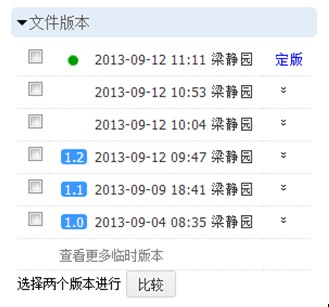
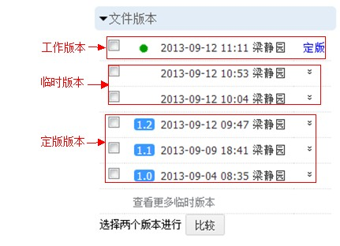
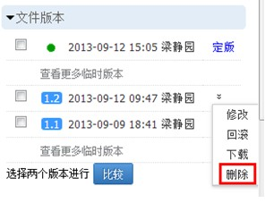

===============================
版本管理
===============================
.. sectnum::

文档版本管理的常见问题
====================================
- 原始文档修改后仍有人使用旧版，出现流通中文档版本混乱现象。
- 依靠文件名来区分各个版本，查找最新版本不够一目了然，大量旧版本文档维护繁琐
- 对文件没有完整的操作记录，修改版本后不知道操作人及操作时间
- 不知道新版文档的创建用户、更新时间、版本更新次数等信息

易度文档版本管理
====================================

易度文档版本管理支持用户直观方便地进行文件存取、版本更新、历史版本浏览、文件版本比较、版本回滚等操作。每个文档右侧，可查看文档的版本历史：

文件修改自动保存历史版本
------------------------------------------------
在易度中打开一个文档，默认看到的是最新版本，这也就是工作版。可以对工作版本进行编辑修改等操作。

文档内容一旦修改、或者上传新版本，旧的文档会自动保存为历史版本。这样文档的所有修改历史，都可以在历史版本中找到。历史版本可以在线查看，但不能被修改，默认情况不能被搜索到。

文件定版
-------------------------------------------------
每次修改都会保存历史版本，这样会导致大量的历史版本。对于重要的版本，我们需要清晰标识；对于不重要的版本，则需要清理，以减少空间占用和避免干扰版本查找使用。

可以对工作版本执行定版操作，给予该版本明确的版本版次和说明信息，这个版本会长期保留。

.. image:: pic/dingban.jpg
   :alt: 文件定版

版本区别
-------------------------------------------------
临时版本是没有定版的历史版本。每个文件最多保留最近20个次临时版本，多余20个会自动清除；临时版本也不会记录文件关联关系。

定版的历史版本，可以建快捷方式、附件、关联；可以添加关注、进行收藏、查看或进行评论、分享、外发、发起流程。

版本比较
-------------------------------------------------
所有可在线预览的文档，均支持在线版本差异比较，用户可任选两个版本进行比较，比较结果会自动显示。

.. image:: pic/chayibijiao.jpg
   :alt: 版本比较
   :width: 490
 
版本删除
-------------------------------------------------
无需保留的历史版本，可以删除。被删除的版本进入回收站，可以事后从系统操作历史中恢复，避免误操作丢失数据。

版本回滚
-------------------------------------------------
如果发现需要使用之前的一个历史版本，点击该版本的回滚菜单项，将该版本保存为文档的最新工作版本。

