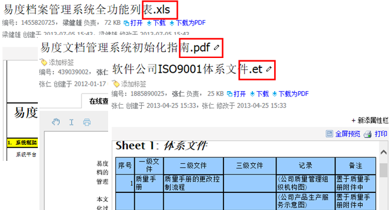
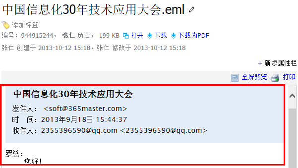

============================
　文档查看
============================

易度提供了文档云端查看功能，支持各种文件在线查看，无须安装插件，速度比本地更快。

常见办公文档查看
====================================
系统支持常见办公文档：Office03/07，WPS09、openoffice、PDF、.txt、.html等格式文件内容的直接在线查看，无须安装任何插件。支持边看边下载技术。

所有可在线预览的文件，下载同时能够自动生成PDF形式。

.. image:: pic/view03.png
   :width: 450px

图片缩略预览
====================================
用户上传的图片，可以自动生成缩略图形式，避免图片过大导致下载速度缓慢，影响查看效果。系统支持各种常用的图片格式：bmp、jpg、png、gif、tiff等。

压缩包文件查看
====================================
支持rar、zip、tar、tgz等压缩包格式文件的直接在线查看。无须安装插件即可查看压缩包内的文件清单，同时支持下载压缩包内文档。

.. image:: pic/view-img007.png

图纸在线预览
====================================
系统可自动将AutoCAD图纸生成图片形式，用户可以快速在线预览查看。同时采用插件架构，可方便扩展支持其他的格式。

.. image:: pic/view-img002.png

安装 eDrawing，可实现2D/3D图纸的在线查看。支持dwg、Pro/ENGINEER: PRT 、CALCOMP: PLT、 Protel: PCB、 IIIustrator: AI、Unigraphics: PRT catia/cati5:
CATPart、Inventor: IAM、SolidEdge: ASM, ASM、SolidWorks: SLDASM, SLDPRT EDA: PCB,SCH, STP等格式。 

.. image:: pic/view011.png
    :width: 400px

流媒体在线播放
====================================
系统支持mp3、wma、rm、wav、mid音频和avi、rmvb、mov、mp4、swf、flv、mpg、ram视频等各式的流媒体文件在线播放，无需安装任何插件。

存档邮件(.eml)查看
====================================
直接查看邮件内容，包括邮件附件。

