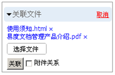

========================
查看和播放
========================

.. sectnum::

文档在线查看
====================================
系统支持常见文档在线查看预览，用户无须安装任何桌面软件，便可查看文档内容。具体包括： Office文件（包括office 2003和2007），.txt，rtf，PDF，mht文件等。

图纸在线预览
====================================
对于AutoCAD图纸，系统可自动生成一个图片，方便用户快速在线预览查看，极大地提高了用户的工作效率。系统采用插件架构，可方便扩展支持其他的格式。

.. image:: pic/view-img002.png
   :alt: 在线预览AutoCAD图纸
   :width: 437px

2D/3D图纸在线查看
====================================
使用IE浏览器，并安装 eDrawing ，可实现在线查看3D图纸

.. image:: pic/view-img003.png
   :alt: 在线查看2D/3D图纸
   :width: 555px

图片缩略图预览
====================================
用户上传的图片，可以自动生成缩略图显示，避免图片过大导致下载速度缓慢，影响查看的感受。系统采用PIL (www.pythonware.com/products/pil/) 实现。支持各种常用的图片格式， 如.jpg 、.gif、.png、tif、 bmp等。

图片相册查看
===================================
可以用相册的形式来查看图片。

.. image:: pic/view-img006.png
   :alt: 图片相册
   :width: 400px

流媒体在线播放
====================================
系统支持各种流媒体格式，只需安装浏览器flash插件，便可支持对流媒体(音频、视频)文件的播放。易度采用标准的http1.1文件传输协议中的range数据传输控制命令，来实现按需的数据传输，实现即时播放。系统支持avi、wmv、flv、ogg、mp3、mov、mpeg等各种格式文件的播放。

预览压缩包文档
====================================
无需安装插件，系统支持在线查看压缩包里的文件文档。

.. image:: pic/view-img007.png
   :alt: 预览压缩包
   :width: 433px

文档自动生成PDF
====================================
所有可在线预览的文件，都可自动生成PDF格式的文件。并供用户下载使用

快捷方式查看
==================================
可在其它目录或文件夹中创建一个快捷访问图标，类似电脑的桌面快捷方式，免去文件产生过多副本，节省空间。

.. image:: pic/view-img008.png
   :alt: 文档快捷方式
   :width: 247px

文档关联
====================================
用户可通过文档关联功能，把相关的文件关联起来，集中储存和管理。利用文件关联的功能，可快速找到关联文件。 

