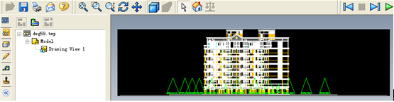
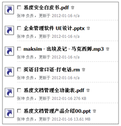
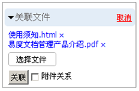
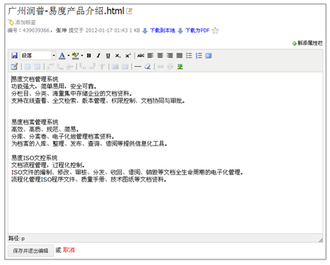
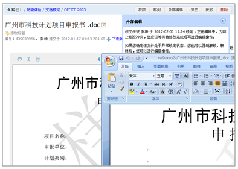
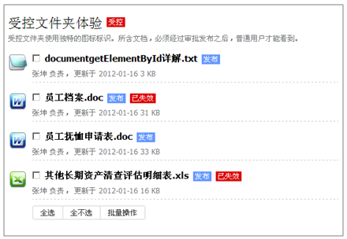
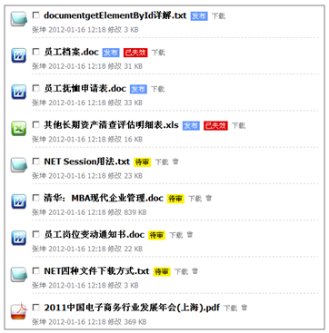
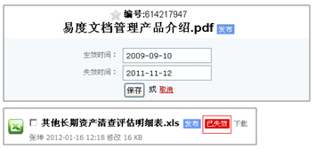
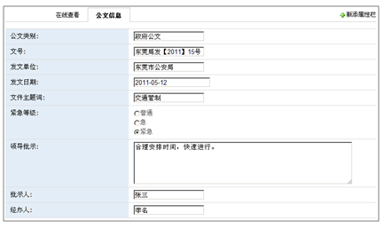

=========================================
企业文档管理解决方案
=========================================

.. contents::
   :depth: 1

.. sectnum::

企业文档管理系统概述
=================================

易度文档管理系统是润普公司基于知识管理的理念，开发的一套用于企业文档资料管理、知识管理的软件系统，帮助企业进行文档的全生命周期管理。系统采用了领先的文档权限控制和SSL传输加密技术，支持文档的共享和审核协作管理，并提供强大的文档检索机制。

通过易度文档管理系统，企业可以高效、快捷地解决文档的存储、文档的安全防护、文档的查找、文档的协作、文档的在线查看及文档发布问题。

易度文档管理系统适合于任何体系、任何规模的企业组织。

企业文档管理的六大问题
======================================

文档缺乏集中管理
-----------------------
- 日积月累下来，企业文档的数量和容量都很庞大。特别是知识型企业
- 所属部门、类型、格式、用途不同，管理方法不同
- 海量文档分散在不同部门，甚至个人手中，难于查找、控制

文档安全难以保障
-----------------------
- 文档分散存储，容易丢失
- 文档权限控制不明，容易泄密
- 纸质文档的抗灾难性差

文档版本管理混乱
-----------------------
- 文档版本繁多混乱，难以找到最新最正确的版本
- 文档历史版本无法丢失，造成知识流失
- 版本使用错误，而导致各种质量事故

查找缓慢，效率低下
-----------------------
- 每天需要花大量的时间去查找文档资料
- 人工方式和资料柜管理，查找非常缓慢
- 工作效率大为降低

文档无法有效协作共享
-----------------------
- 文档共享不方便，员工难以获取所需的资料
- 文档审核流程复杂，无法实现自动化管理
- 缺乏高效的共同编写文档方式（合同、解决方案等)

知识管理举步维艰
-----------------------
- 员工离职，交接不全，带走了企业的知识（人才流失=知识流失）
- 企业内部缺少分享经验和共享知识的环境和氛围
- 知识沉淀、挖掘、清理，缺乏电子化工具

易度企业文档管理解决方案
==================================================
针对上述问题，结合文档管理系统，易度提出了相应的解决方案

- 易度文档管理系统建立中心文档库，实现企业文档管理制度化；
- 采用 “四层六级”的权限体系数据容灾存储，记录文档使用痕迹；
- 提供文档版本管理和发布流程控制，涵盖编写、审核、发布、更改等各环节；
- 提供毫秒级的全文搜索，可以多维度组合搜索，省时、高效；
- 以文档为中心的多人协作环境沟通更直接、更高效；
- 易度建立企业知识体系和脉络；通过多种沟通渠道，挖掘、传播隐性知识

企业文档管理库
=============================

通过简单可靠的存储方式，集中管理文档

简单存储
---------------------------------------------
- 直接采用文件系统存放文件和元数据
- 文档的存取不依赖于任何数据库系统，不会因数据库系统的故障而导致数据丢失
- 文档的存取不依赖易度文档管理系统，即便易度系统出现故障，仍然可通过传统的途径管理文档库

集中（分区）存储
---------------------------------------------
- 建立文档的集中式的存储，对文档进行有效的分类管理
- 分为个人区、公司文档区和网络共享区，分区进行文档分类管理

.. image:: img/edm-img025.png
   :width: 440px

海量储存，无限扩容；自动备份
---------------------------------------------
- 可以储存并管理海量的文档文件，并无限扩展空间容量
- 支持镜像备份，增量备份或差异备份等备份方式

.. image:: img/whitepaper_r9_c5.gif
   :class: float-right

RAID容错磁盘阵列
---------------------------------------------
- 方便灵活配置扩展硬盘
- 方便和NAS磁盘设备结合

文档的安全和防护
============================

严格的文档权限管理
---------------------------
- 支持授权委托管理，可单独针对各个文件夹指定文件夹管理员，文件夹管理员在该文件夹下拥有全部管理权限
- 支持成组授权，针对某个部门、某个岗位进行授权
- 支持负授权，禁止群组中的特定成员用户的权限 
- 支持6级查看人权限，可单独对文档的查看、下载、打印、修改、删除等权限进行控制，严防泄密
- 支持权限继承，子文件夹自动继承上级授权，也可禁止上级授权
- 具备文档保密性控制功能，保护核心文档

.. image:: img/edm-img001.png
   :width: 440px
   :alt: 文档权限管理

完整的文档操作历史记录
------------------------------
- 可以记录文件或文件夹的操作历史，包括文件或文件夹的创建、编辑、版本、流程、打印等
- 所有删除文件都会自动进入回收站，通过操作历史的查询，可以还原已经删除的文档
- 同时也会记录系统的操作历史，便于系统管理员检查系统，避免出现问题

.. image:: img/edm-img002.png
   :width: 440px
   :alt: 文档操作历史记录

支持Https安全传输和病毒扫描防护
-------------------------------------
- 可使用apache的安全传输https的功能，采用网上银行相同的技术，实现文件的安全传输
- 系统可支持ClamAV作为病毒扫描引擎
- 上传文件，均会进行病毒扫描，如果发现病毒，会通知管理员进行处理

文档在线查看预览
=======================================

在线查看办公文档
------------------------------------
- 系统支持Office 2003 、Office2007、WPS、PDF等办公文档的在线预览和全屏预览
- 系统可自动生成PDF，同时保存原文件和PDF文件，并提供下载

.. image:: img/edm-img003.png
   :width: 440px
   :alt: 在线查看办公文档

在线查看AutoCAD图纸
------------------------
- 无需任何插件，AutoCAD图纸可以直接在线预览

.. image:: img/edm-img004.png
   :width: 437px
   :alt: 在线查看AutoCAD图纸

在线查看2D/3D图纸
-----------------------
- 使用IE浏览器，并安装 eDrawing ，可实现在线查看3D图纸

在线播放流媒体
----------------------
- 系统支持各种格式的流媒体（音频、视频）在线播放

.. image:: img/edm-img006.png
   :alt: 在线播放视频

.. image:: img/edm-img007.png
   :alt: 在线播放音频

在线预览图片
-----------------------
- 可以缩略图预览，支持相册式播放

.. image:: img/archive-img022.png
   :width: 370px

在线查看压缩包
-------------------
- 无需安装插件，系统支持在线查看压缩包里的文件文档

.. image:: img/edm-img008.png
   :width: 433px
   :alt: 在线查看压缩包

创建快捷方式
------------------------
- 可在其它目录或文件夹中创建一个快捷访问图标，类似电脑的桌面快捷方式
- 免去文件产生过多副本，节省空间
- 原文件与快捷方式文件的修改是同步的

关联文档
------------------
- 文档之间可以相互关联，快速查看更多相关文档
- 可以将关联和文档定义为附件关系

解决文档协作问题
==============================

在线编写文档
---------------------------
- 无需安装程序，可在系统中直接创建html、txt、rst文档
- 可直接在线修改此类文档，提供锁定保护

在线修改文档
---------------------------
- 只需要安装易度的外部编辑器插件就可以在线修改文档
- 文档修改时自动加锁，防止多人同时修改的情况
- 保存后，文档会自动上传至服务器中，并覆盖原文档或创建新版本

提供强大、易用的版本管理
-------------------------------
- 文档一旦定版，后续的修改，将自动保存为新版本
- 版本版次自动维护，上传新版本的时候，系统自动推荐一个版本版次。用户也可以手动进行调整
- 提供版本差异比较，所有可以在线预览的文档，均可支持在线版本差异比较
- 提供文档历史版本的下载

.. image:: img/edm-img013.png
   :width: 400px
   :alt: 文档版本管理比较

提供文档评注和订阅功能，帮助企业员工协同共享文档
-----------------------------------------------------
- 可关注文档，或者将文档分享给其他用户
- 可直接发表评注，表达观点，动态订阅相关的文档
- 可在评注当中添加上附件，令其更加直观
- 支持三种通知方式：系统消息通知、电子邮件通知和手机短信通知

提供强大快速的搜索功能
===================================

支持全文检索，多组合的高级搜索功能
---------------------------------------
- 可根据文件正文内容信息精确搜索到相关文档
- 支持全文检检索的类型：.doc,.rtf, .xls, .csv, .ppt, .pdf, .txt, .htm, .html, .xml, .rst
- 可根据文档的标题、正文内容、文档标签、创建人、创建时间、修改时间、文档编号、关键字、格式、状态等进行搜索。

.. image:: img/archive-img016.png
   :width: 400px

通过标签组进行搜索
-----------------------
- 可管理、多层次、多维度的标签分类机制
- 可通过标签组快速查找到相关的文档，一个文档可添加多个标签

.. image:: img/archive-img017.png

.. image:: img/archive-img018.png
   :width: 300px

提供收藏夹功能
-------------------------
- 收藏一些常用的、关注的文档，并通过文档标签功能进行个人知识管理
- 可以通过收藏夹方便快捷地进行文件查找和定位 

控制文档的发布
===============================

受控文件夹，保证文档发布正确
-------------------------------------
通过受控文件夹，将文件夹设置为受控状态，可保证一般查看人无权查看到未发布的内容，只可以查看到已发布或已失效的文件保证文档发布的正确性

设置文档状态
-----------------------
- 配备简单的文档审核流程：草稿—>待审—>发布，发布状态的文档不能再作修改
- 文档还具备保密状态

文档编号和时效控制
-------------------------
- 根据规则，文档可以自动编号
- 发布的文档可以调整生效和失效的时间
- 超过这个时间段后，文档标题后会自动显示“已失效”标识

系统定制
================

自定义流程
--------------------------
系统自带常用的审批、借阅等文档流程。也可按需自定义流程包括表单、流程、阶段等，支持脚本开发和流程图形化绘制

.. image:: pic/edodocs-isodoc-image035.jpg
   :width: 420px

自定义扩展属性
--------------------------
可以自定义文档的扩展属性，完整描述文档，一份文档可以支持多组扩展属性；另外，扩展属性也可以用于搜索

自定义规则
--------------------------
规则，就是当发生某个事件时，文件夹或文件自动执行某些操作，如自动添加扩展属性，自动进行OCR识别

自定义显示列
--------------------------
可以自定义文件夹或文件的查看显示方式，如缩略图查看、内容列表等；也可以调整文件的显示信息，如显示文档负责人、大小等

.. image:: img/edm-img019.png
   :width: 470px

集成和扩展
=======================

与扫描仪集成
--------------------------
与扫描仪紧密集成，可把纸介质文件直接扫描至系统中。拥有文字OCR识别和自动分拣功能，扫描后可批量合并成(双层)PDF文档

.. image:: img/edm-img020.png
   :width: 440px
   :alt: 管理系统与扫描仪集成

批量上传和下载
--------------------------
提供web文件夹的访问方式，支持批量上传和下载，拖放等

.. image:: img/edm-img021.png
   :width: 400px
   :alt: 文档文件批量上传下载

定制部署栏目
--------------------------
自由部署多个文件库 、公告等内置应用，更有数十种扩展应用自由选择

.. image:: img/edm-img022.png
   :width: 400px

提供一个全开放平台
--------------------------
开放全套API，自带开发平台，自由按需定制扩展，并提供一组集成API，可方便OA等其他系统集成

.. image:: img/edm-img024.png

.. raw:: html

  <h3><a href="http://download.zopen.cn/releases/docs/%E6%98%93%E5%BA%A6%E6%96%87%E6%A1%A3%E7%AE%A1%E7%90%86%E4%BA%A7%E5%93%81%E4%BB%8B%E7%BB%8D.pdf" rel="nofollow">下载《企业文档管理介绍》</a></h3>

