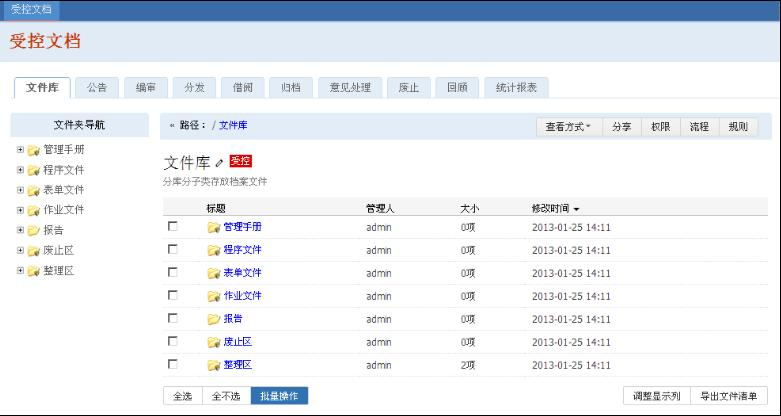
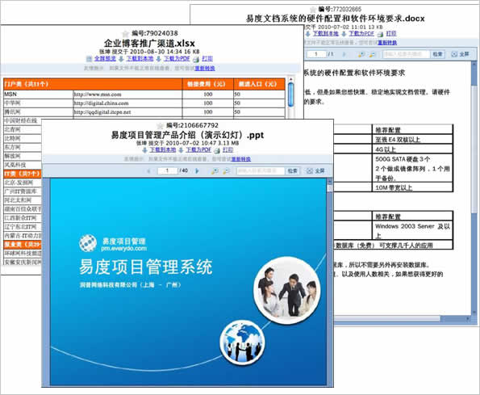
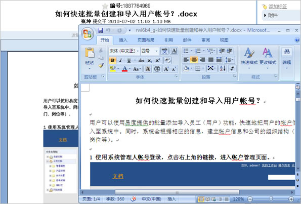
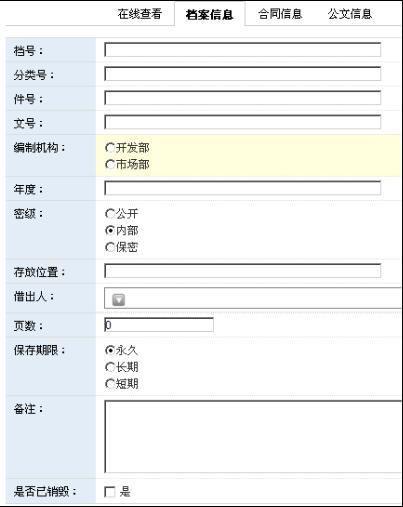
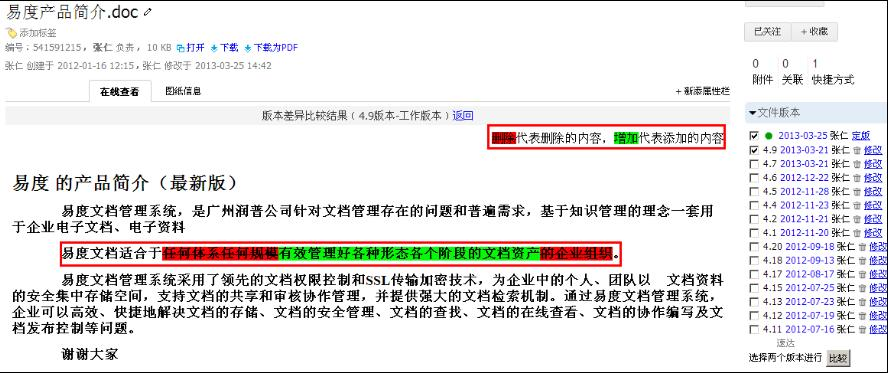
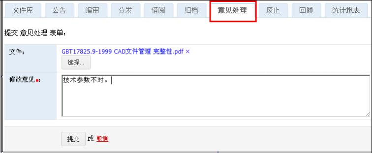
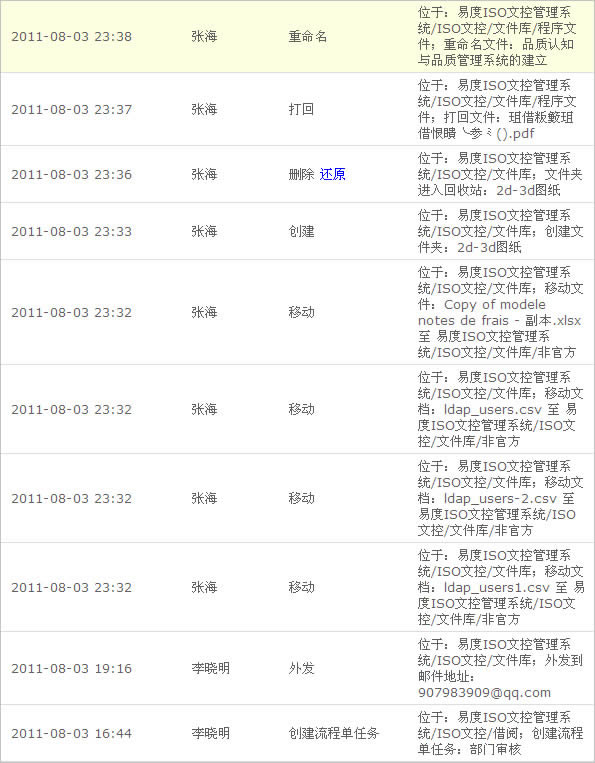
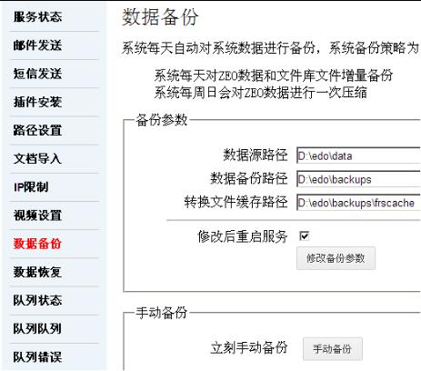
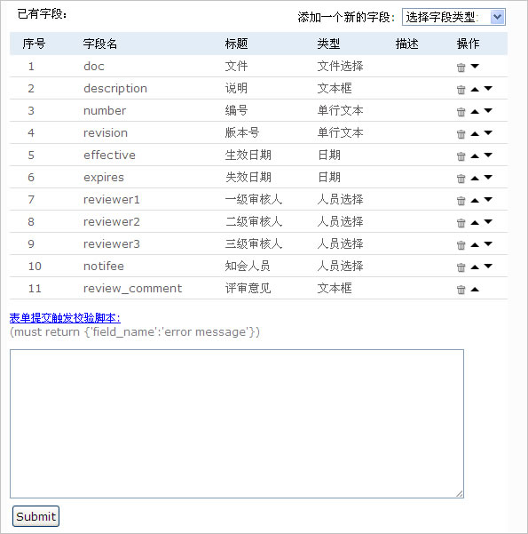

.. image:: pic/edodocs-isodoc-image001.jpg

.. contents::
   :depth: 1

.. sectnum::

产品概述
====================================================

易度文控管理系统遵循国际文档质量体系标准，对文档的编制、修改、审核、分发、收回、借阅、废止、回顾等流程进行全生命周期的电子化管理。

主要文件类型包括：质量手册、程序文件、作业指导书、表单文件、工艺文件、技术图纸、代码文件、报告。

适用于制造业、建筑工程公司、设计公司、研究所等企业组织。

传统文控存在的问题
=======================

传统文控管理采用纸质管理，存在如下问题：

- 文件资料只通过纸质管理，查阅不方便

- 异地工作或者出差导致无法签字审批文件，审核效率低

- 纸质文件分发收回管理繁琐、难以做到异地分发、容易出错

- 缺乏自动化工具，大量文档难以维护

易度文控解决方案
========================

- 建立文件电子档案库

  集中存储管理，整理文件的入库、借阅、统计

- (自动)控制文件的发布过程

  起草、审核、修改意见、更新、版本

- 控制文件的分发、收回
  保证文件传输的正确和安全

- 控制文档的更新和失效控制

  失效回顾、文档废止

文件电子档案库
=====================

文件档案管理包括如下内容：

- 建立文件库，集中存档文件

- 实现文件在线查看，在线修改编辑 

- 强大的检索查找功能

- 设置权限控制，安全防护

- 版本管理，差异比较

集中存档受控文档
---------------------------

根据对文档的类型或者需求，可以把文档分类，如：管理手册、程序文件等，系统支持无限层级的文件夹目录结构。同时支持电子和纸质文件的管理。

文档在线直接预览
---------------------------

易度文控管理系统支持文档的在线直接预览，包括OFFCIE、WPS、PDF等日用常见文档，还包括CAD、PROE、CATPArt等二/三维图纸。对于图纸文档，还可以实现放大、缩小、旋转和局部查看等功能。

Office 文件

   
PDF文件

.. image:: pic/edodocs-isodoc-image004.jpg 
   :width: 400
   :alt: 在线查看PDF文件

CAD 图纸

CATPArt 三维图纸

.. image:: pic/edodocs-isodoc-image007.jpg 
   :width: 400
   :alt: 在线查看三维图纸

文档在线编辑/修改
--------------------------
   
易度文控管理系统支持对文档进行在线编辑/修改，通过易度的外部编辑器，即可实现把OFFICE、WPS、PDF、TXT等在线编辑，文件修改时自动加锁，防止多人同时修改的情况。保存后，文档会自动上传至服务器中，并覆盖原文件或创建新版本，免却重复下载和上传的繁琐操作。

文档扩展属性
-----------------------

易度文控管理系统中支持描述文档附加信息，可自定义。

受控文档检索：强大的搜索功能
-----------------------------

易度文控管理系统提供全文检索、高级搜索、文件夹内搜索等多样化搜索功能，支持对OFFCIE、PDF、TXT等常用文档进行全文检索。同时，您也可以通过文档的编号、类型、标签、失效时间、创建人、审批人等多个维度查找到文档。

.. image:: pic/edodocs-isodoc-image008.jpg 
   :width: 400
   :alt: 全文检索和高级搜索

受控文档检索：标签组搜索
------------------------

易度文控管理系统提供多维度、多层次、可管理的标签分类搜索。

.. image:: pic/edodocs-isodoc-image037.jpg
    :width: 400
    :alt: 标签组搜索

版本管理
--------------------------

易度文控管理系统自动保存文档的历史版本，并提供下载，不同版本间可进行版本差异比较。

权限控制
--------------------------

易度文控管理系统中有严格的权限控制。公开的文档，直接可在线查看。内部文档，可借阅查看。保密文档，授权才能查看。可对文件夹、文件进行额外授权。

文件流程控制
====================

易度文控管理系统主要侧重于对文档的全面控制和流程化管理，通过流程全面控制受控文档的正确性、安全性、规范性等。系统提供标准的文档工作流，客户可根据实际需求进行调整。

发起文档的相关流程
-------------------

易度文控管理系统可在文档右侧，直接发起各种相关流程。

.. image:: pic/edodocs-isodoc-image039.jpg
    :width: 600
    :alt: 发起关联流程

查看和文档关联的流程
-----------------------

易度文控管理系统可方便查看文档相关的所有流程单。

.. image:: pic/edodocs-isodoc-image040.jpg
    :width: 600
    :alt: 查看关联流程

流程控制：编审流程
---------------------

易度文控管理系统支持多种文档审批流程，对文档和文档附件同时审批，一起发布。已发布的文档，支持可对分支版本进行审批。

编审流程：完全自定义审批流程和人员
--------------------------------------

用户可自定义每个审批步骤、审核人、权限，并支持分部门审批

.. image:: pic/edodocs-isodoc-image014.jpg
    :width: 400
    :alt: 自定义审批流程

|

流程表单

.. image:: pic/edodocs-isodoc-image015.jpg
    :width: 400
    :alt: 审批流程表单

流程控制：分发和收回流程
---------------------------

系统提供电子文档和纸质文档的分发，由上而下进行受控文档分发管理。可同时给多个部门分发多个文档，大大提升文档分发的效率。同时，也为多个分公司、办事处等拿到文档提供更安全的处理方式。过期版本的文档，需要把电子档进行回收处理，降低各部门，特别是制造部门使用错误文档版本的可能性。

.. image:: pic/edodocs-isodoc-image016.jpg
    :width: 600
    :alt: 分发流程

|

分发流程表单

.. image:: pic/edodocs-isodoc-image017.jpg 
   :width: 600
   :alt: 分发流程表单

|

收回流程表单

流程控制：借阅流程
-------------------

易度文控管理系统中有严格的权限控制，当没有权限查看或下载文档时，可通过借阅流程申请相应的权限进行借阅操作。审批通过后自动有相应的权限。

流程表单

.. image:: pic/edodocs-isodoc-image020.jpg 
   :alt: 借阅流程表单

流程控制：归档入库流程
-----------------------

大量现有的文档需要归档到系统中规范化管控，这时候需要归档审核流程。系统提供上传文件归档、和选择文件（夹）归档两种方式。

流程控制：意见处理流程
---------------------------

文档查看人可对文档的内容提出新的修改意见，由文档负责人决定采纳或者拒绝。

流程控制：废止流程
-------------------

过时文档可通过废止流程废止，并转存到废止区域。

.. image:: pic/edodocs-isodoc-image022.jpg
    :width: 400
    :alt: 废止流程

流程控制：回顾流程
----------------------

文档负责人检查即将到期的文件，检查是否可以继续使用，或者需要更新版本。

文档报表统计
===================

易度文控管理系统提供各种统计报表，方便对档案管理工作的监控、评估和管理。

|

回顾文档情况表

.. image:: pic/回顾文档情况表.jpg
    :width: 500
    :alt: 回顾文档情况表

|

文件夹信息统计表

系统管理与维护
===============

全方位保障文档的安全
---------------------------

易度文控管理系统可全方位保障文档的安全，从文档的存储、权限控制、操作历史记录、文档还原、文档与数据自动备份等多方面保障其安全。为您的文档保驾护航。

简单存储
---------------

易度文控管理系统采用开源的、简单的存储方式，直接把受控文档的原文件存储到服务器的硬盘中，即使操作系统中毒、数据库崩溃都对文档没有影响。

历史记录
------------------------

易度文控管理系统为文档提供详细的操作历史记录，可通过记录查询到文档被查看/打印/下载的时间、次数、人员等详细的操作信息。 具备回收站的功能，可以把误删的文档通过操作历史直接还原。

自动备份
-------------------------

易度文控管理系统采用rsyn备份软件对文档和数据进行自动备份，包括每日增量备份、每周归档备份两种备份方式，包括文档数据的安全。可以每日/每周备份，支持自动备份和增量备份，也可以手动备份，自定义时间手动还原

定制和集成
============

系统具备高可定制性
-------------------------------

易度文控管理系统是一个高可定制性的系统，可以根据用户的需求进行个性化的调整与修改。满足不同企业对文控管理的不同需求。 包括界面、表单、流程、编号规则等都可以进行个性定制.

表单自定义
++++++++++++++++++++++

系统支持表单自定义，可添加、修改和删除在流程表单中的字段。自定义合适自身企业的设计表单。

流程自定义
+++++++++++++++++++++++

系统支持流程自定义，通过可视化的流程图的功能进行流程步骤等更改。

.. image:: pic/edodocs-isodoc-image035.jpg 
   :width: 400
   :alt: 自定义流程

编号规则自定义
+++++++++++++++++++++++

提供自动编号规则，自带标准的编号规则：部门-产品-流水号。实现对受控文档的规范化管理的要求。

如有需要，客户可对编号规则自定义，在现有编号规则基础上，变化相关的参数即可实现企业的自定义编号规则需求。

.. image:: pic/edodocs-isodoc-image036.jpg 
   :alt: 自定义编号规则

系统具有强大的集成性
-------------------------------

易度文控管理系统提供开发的API接口，可无缝集成企业的业务系统如：ERP、PDM、CRM、OA、财务系统、企业门户等，已实现标准的SSO单点登录。

.. raw:: html

  <h3><a href="/download.rst" rel="nofollow">下载易度文控管理</a></h3>
