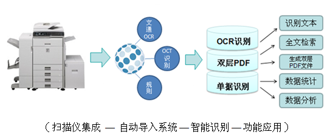
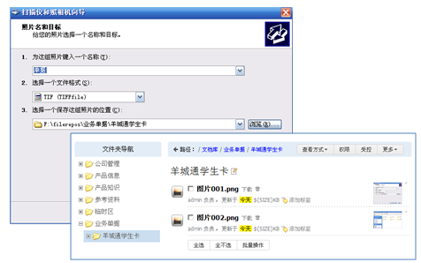
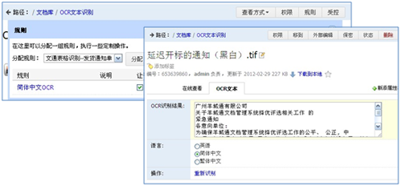
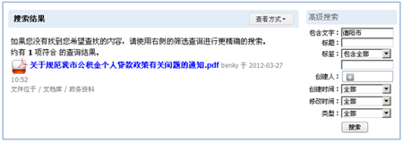
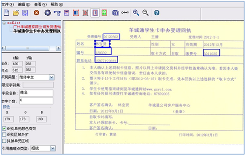
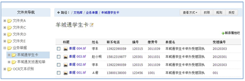

========================
文档影像管理
========================

.. contents::

.. sectnum::

企业现状及问题
-------------------
企业在业务过程中，会出现大量的纸质文件，比如单据、发票凭证、与客户、供应商的往来文件、市场情报等。

纸质文档在管理和使用上存在诸多问题：

- 存放纸质文档，需要占据大量的空间
- 查看、检索、分享、统计存在诸多不便
- 抗灾难性差，容易损坏
- 需要额外的管理设备和人力资源开支

典型行业：金融、政府、交通、通信、部队等

文档影像管理需求
-----------------------

纸质文档的电子化，不同企业有不同的需求。但通常分如下几种：

- 海量纸质文档电子化入库

    海量纸质文档电子化，转换成电子文档，能够集中存储，方便查看、借阅等操作使用

.. image:: img/paper-img001.png
   :alt: 纸质文档电子化入库

- 扫描文档自动OCR文字识别和搜索

    对于通知、传真、合同，公函等文件，由于数量比较大，搜索成为一个难题。因此如何提取扫描电子文档中的文字，并提供修正、搜索的功能，成为纸质文档电子化之后急需解决的问题

- 扫描文档制作为双层PDF

    对于电子书籍、公文等正式文档，存档要求非常高。通常需要自动生成双层PDF文件，同时包含原始扫描图片和文字信息，这样方便文档搜索和文字复制

- 单据电子化，数据提取、分析、统计

    企业业务流程中产生大量的单据，比如申请单、交易单据、会员信息表。表单中的数据是结构化的，同类型的表单格式固定

    单据中的关键数据，需要按字段提取，提供更加个性化的搜索，甚至需要进行统计分析

易度解决方案
-------------------

易度文档影像管理系统，可以将纸质文件，如：单据、档案资料、合同等，转换成电子文档，并集中存储到系统当中，提供方便灵活的管理功能，帮助企业更便捷、高效地管理好海量纸质文档：

- 纸质文档电子化
- 自动入库
- OCR文字识别
- 智能化统计分析处理

通过文档管理系统及一组扩展软件包，结合完整的纸质文档电子化方案，实现企业纸质文档电子化管理，满足普遍企业的需求

- 易度文档管理系统高级企业版与扫描仪集成，扫描后文档自动进入系统
- 使用系统中的“规则”，自动对文档执行OCR智能文字识别、双层pdf转换、单据识别等操作
- 提供强大的文档管理功能，包括搜索、在线查看、数据统计报表等

扫描文件，自动入库
++++++++++++++++++++++++++++
配置NetDrive驱动，将易度文档管理系统中的文件夹映射为一个虚拟盘，可直接通过windows资源管理器访问

.. image:: img/paper-img003.png
   :alt: 扫描文件自动入库-虚拟盘设置

使用扫描仪的向导工具，设置扫描文件存放位置为虚拟盘中的文件夹。这样，扫描件自动进入文档管理系统指定的文件夹

   
   
OCR文本识别和搜索
+++++++++++++++++++++++++
通过“规则”，使文件上传到易度文档管理系统后，自动执行“OCR识别”和增加“OCR文本”的扩展属性

OCR识别后会将识别结果填入扩展属性的文本框，可用于搜索；如果识别有误，可手工校正
 

   

自动生成双层PDF
+++++++++++++++++++++

- 设置部署规则

    使用文档管理系统，通过扩展软件包，部署并应用“文通双层PDF规则”，分配此规则到所需的文件夹

.. image:: img/paper-img006.png
   :alt: 自动生成双层PDF-设置规则

- 生成双层PDF

    经过OCR识别后的图片层的PDF文件，可自动生成图片层和文字层的双层PDF文件

.. image:: img/paper-img007.png
   :alt: 自动生成双层PDF-生成新版本文件

- 全文检索文件

    文件识别并生成双层PDF后，支持全文检索，如，通过搜索“德阳市”，可找到此文件

   
   
单据表格识别
++++++++++++++++++++++

- 划分识别区域

    可对需要提取的区域进行划分，然后对区域中的内容进行识别，识别结果将自动导入到易度文档管理系统中，可大大提高录入校对的工作效率

- 利用规则识别数据

    采用分类文件夹存储不同类型的业务单据，相应的文件夹可自定义对应的识别规则

    比如，羊城通学生卡单据存储在“羊城通学生卡”的文件夹中，采用“文通表格识别――学生卡”的规则

.. image:: img/paper-img010.png
   :alt: 单排表格识别-利用规则识别数据

- 自动提取数据

    通过“规则”可自动为当前文件夹的文档增加扩展属性，如，上传文档后自动增加“学生卡单据”的扩展属性栏目

    系统会将识别结果自动填充到扩展属性对应的字段中，实现数据的自动提取并记录

.. image:: img/paper-img011.png
   :alt: 单排表格识别-自动提取数据

- 数据信息视图

    可调整视图，并设置属性显示到默认视图中，概览文件夹内所有文件的数据信息

数据统计报表
++++++++++++++++++++++
文档管理系统当中，提供各种统计报表，方便对工作的统计、监控和评估

.. image:: img/archive-img032.png

安全防护
++++++++++++++++++++
“四层六级”的权限管理，控制用户对文档的操作使用，包括查看、打印、下载、复制、邮件外发和编辑、删除

设置文档“保密”状态，保证普通人员无法查阅该文档

.. image:: img/edm-img001.png

在线查看文件
+++++++++++++++++++++
文档管理系统支持所有主流格式文件的在线查看、预览，包括：PDF、office办公文档、图片、图纸、音频、视频

.. image:: img/paper-img013.png
   :alt: 在线查看文件预览图

高级搜索功能
+++++++++++++++++++++++
文档管理系统提供多维度、多层次的搜索机制，毫秒级的文件检索功能

- 全文检索

根据文档正文内容信息，精确搜索相关文档
支持格式：.doc,.rtf, .xls, .csv, .ppt, .pdf, .txt, .htm, .html, .xml, .rst

- 高级搜索

可根据文档的标题、创建人、创建时间、修改时间、文档编号、关键字、格式、状态等多维度组合搜索。

- 标签组搜索

系统提供自定义标签的功能，可为文档定义不同的标签属性
通过“标签”快速定位文档，一个文档可添加多个标签

技术简介
--------------------

- 集成Tesseract-OCR开源OCR识别

Tesseract-OCR是开发于惠普实验室，支持几十种语言，包括简体中文繁体中文等，后被Google收购，Google开源到Google Code。易度可集成开源的Tesseract-OCR，识别效果非常好。

- 集成北京文通OCR识别

北京文通是国内做OCR识别、尤其是中文识别属一属二的产商，Microsoft的Word 2007集成的OCR识别就是集成清华文通的产品。易度先后通过集成文通OCR识别完成了政府、部队的几个项目。它不但识别率高、识别效率快，且支持制作双层PDF等。

- 集成北京文通表格识别

北京文通主要为金融、政府、交通、通信等行业处理业务单据量非常之庞大提供最精确的表格识别。
易度文档管理系统是集成文通表格识别，通过扫描、图像处理、自动表格分类，OCR等技术，将表格数据以及图像准确、快捷、真实地提取并保存。
