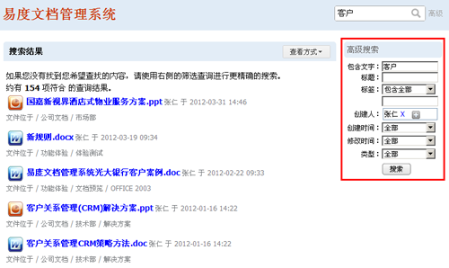
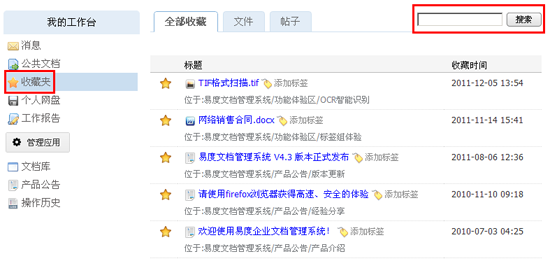

==================================================
搜索查找
==================================================
.. sectnum::

今时今日，企业所面临的主要挑战之一是如何从知识中获得更多的价值，尤其是企业自身一点一滴辛苦积累起来的知识。对于这些知识员工们利用情况是怎么样的呢？

  - 员工发现，在公司知识库中搜索信息的过程并非一帆风顺；
  - 他们无法自如地在不同类别的知识之间进行浏览；
  - 由于没有得到相关的背景资料，他们无法衡量所找到的知识的价值。

许多用户会为此而放弃搜索的努力。其实，如果能够找到相应的知识的话，他们就能更好地服务客户，或进行创造性的研究。针对用户的需求，易度文档管理系统提供强大的全文搜索、高级搜索、标签组搜索、收藏夹搜索，保证用户在庞大的企业知识资料库中能够方便、快捷地找到属于自己的知识。

强大的全文搜索
===========================================
易度可对文档进行全文检索，我们采用工业级别的Xiapian全文搜索引擎，可支持海量文档的全文搜索。支持全文检索的格式：.doc,.rtf, .xls, .csv, .ppt, .pdf, .txt, .htm, .html, .xml, .rst等

.. image:: pic/search-img001.png
   :alt: 全文搜索文档

高级搜索
===========================================
系统支持根据时间、创建修改时间、格式、大小等条件对文档进行高级的搜索，确保快速找到需要的文档。

.. image:: pic/search-img002.png
   :alt: 高级搜索文档

基于位置的搜索（文件夹内搜索）
===========================================
系统包括一个路径索引，可限定在某个文件夹范围内搜索，这样可确保搜索更快的，搜索结果更有效。传统的文档管理系统，都无法做到基于位置的搜索。这得益于ZODB对象数据库所独有的路径索引。

搜索后的继续筛选
===========================================
易度文档管理系统支持搜索后可以在结果中继续筛选您所想要的内容。其他系统很少实现这样的功能，大多数系统在搜索后就是列表显示，或者提供排序。

搜索后的继续筛选功能满足了用户搜索的多样化需求，保证用户搜索过程一帆风顺。

搜索结果查看方式
===========================================
提供“内容列表”和“缩略图”查看方式。针对需求，当用户使用“缩略图”查看时，可选择“只查看图片”。

.. image:: pic/search-img006.png
   :alt: 搜索结果查看方式

标签组搜索
===========================================
易度文档管理系统提供创新、实用的标签组功能，标签组(faceted tag: http://facetag.org)是类似百度百科的一种可管理的标签分类管理方法，解决了传统标签云过多缺乏管理的问题。分组标签能从多个角度、多个层次进行全面的标签分类浏览，通过标签组快速查找到相关的文档，一个文档可添加多个标签。

.. image:: pic/search-img004.png
   :alt: 标签组搜索

收藏夹
========================================
用户可将常用的文档收藏到“收藏夹”，可对自己的收藏进行分类管理、添加标签。这样，对庞大的企业文档库，每个人可方便的建立针对自己的小型的文档库，并提供搜索功能，便于用户进行自我知识的管理。

