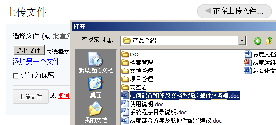

======================
文件上传
======================
.. sectnum::

单个文件上传
-----------------------------------

系统提供文件上传功能。具有文件管理员权限的用户可对文件进行上传操作，非管理员权限的普通用户可在个人区我的文档文件夹内进行上传文件。

批量文件上传
--------------------------------------------

用户通常需要进行大批量的文件上传操作，针对用户的这种需求，系统提供了简易高效的批量上传功能。

- 批量多选上传可直接用鼠标左键框定需要上传的多个文件。

- 系统支持在批量上传过程中自动显示上传进度。

.. image:: pic/上传3.jpg
   :alt: 查看上传进度

- 用户在上传过程中可进行取消操作。

.. image:: pic/上传4.jpg
   :alt: 取消文件上传

webdav接口
-----------------------------------------

webdav是http协议的扩展，是ftp的一个升级协议。简单的说，它可让web可写。windows等操作系统的资源管理器，天然支持webdav协议。 通过资源管理器，可通过鼠标拖放，实现批量文件的上传和下载。

.. image:: picture/tour-img005.png
   :alt: 文档管理系统webdav接口

